# Data Model

DynamoDB tables backing the EPL Fantasy League app, as confirmed via `aws dynamodb describe-table` on 2026-07-29. All tables are in `us-west-2`.

## The two "season" concepts

There are two unrelated identifiers for "which season," and mixing them up caused a real production bug (see `lambda/fpl-data-ingester/index.mjs` and `lambda/stats-api/utils/dynamodb.mjs`, both have a `getCurrentSeason()` comment explaining this):

- **`season_id`** (Number, e.g. `1`) — an internal surrogate key. Used as the partition key for the *reference* tables below (`teams`, `players`, `element_types`, `events`, `player_event_stats`, `fpl_fixture_data`).
- **`season_string`** (String, e.g. `"2025/26"`) — the human-readable season. Used as the partition-key prefix for the *league* tables (`fpl_entry_gameweek`, `fpl_entry_picks`, `fpl_league_standings`, `gw-winners-cache`).

Both live as attributes on the same row in the `seasons` table. Code that needs to resolve "the current season" must read the correct one for its table family.

## Schema diagram

Logical relationships shown here aren't enforced by DynamoDB (no real foreign keys) -- this reflects how the code joins tables via `season_id`/`season_string`, not a database-level constraint.

```mermaid
erDiagram
    seasons {
        number season_id PK
        string season_string "e.g. 2026/27"
        boolean current "exactly one true"
        string status
        number total_gameweeks
        number league_id "FPL classic league ID"
    }

    teams {
        number season_id PK
        number team_id "SK"
        string name
    }

    players {
        number season_id PK
        number player_id "SK"
        string web_name
        number total_points
    }

    element_types {
        number season_id PK
        number element_type_id "SK"
        string singular_name
    }

    events {
        number season_id PK
        number gameweek_id "SK"
        boolean is_current
        boolean finished
    }

    player_event_stats {
        number season_id PK
        string gameweek_player "SK: gw#player_id"
        number total_points
    }

    live_player_event_stats {
        number season_id PK
        string gw_player_timestamp "SK: gw#player_id#timestamp"
        number bonus
        boolean bonus_finalized
        number ttl "24h retention"
    }

    fpl_fixture_data {
        string season_fixture PK "season_id#fixture_id"
        number event "SK: gameweek"
        string status
    }

    fpl_entry_gameweek {
        string season_entry PK "season_string#entry_id"
        number gameweek "SK"
        number entry_id
        number points_total
    }

    fpl_entry_picks {
        string season_entry_gw PK "season_string#entry_id#gw"
        string position_player "SK: squad_pos#player_id"
        boolean is_captain
    }

    fpl_league_standings {
        string season_event PK "season_string#gameweek"
        number manager_id "SK"
        number total_points
        boolean backfilled "true if reconstructed"
    }

    gw_winners_cache {
        string season PK "gw-winners-cache table"
        number gameweek "SK"
        string winners
    }

    seasons ||--o{ teams : "season_id"
    seasons ||--o{ players : "season_id"
    seasons ||--o{ element_types : "season_id"
    seasons ||--o{ events : "season_id"
    seasons ||--o{ player_event_stats : "season_id"
    seasons ||--o{ live_player_event_stats : "season_id"
    seasons ||--o{ fpl_fixture_data : "season_id (embedded in key)"
    seasons ||--o{ fpl_entry_gameweek : "season_string (embedded in key)"
    seasons ||--o{ fpl_entry_picks : "season_string (embedded in key)"
    seasons ||--o{ fpl_league_standings : "season_string (embedded in key)"
    seasons ||--o{ gw_winners_cache : "season_string"
    fpl_entry_gameweek ||--o{ fpl_entry_picks : "entry_id + gameweek"
    fpl_entry_gameweek }o--|| fpl_league_standings : "entry_id = manager_id"
```



---

## `seasons`

The single source of truth for which season is active. Nothing in the four Lambdas writes to this table — it's maintained manually (console or an out-of-repo script).

**Key schema:** partition key `season_id` (N) only, no sort key.

| Attribute | Type | Notes |
|---|---|---|
| `season_id` | N | e.g. `1` — internal ID, joins to reference tables |
| `season_string` | S | e.g. `"2025/26"` — joins to league tables |
| `current` | BOOL | exactly one row should be `true` at a time |
| `status` | S | e.g. `"active"` |
| `start_date` / `end_date` | S (ISO) | |
| `total_gameweeks` | N | `38` |
| `league_id` | N | e.g. `438107` — the FPL classic mini-league ID for this season. Added 2026-07-30 so a league-ID change (already happened once, 212889 → 438107) is a data update instead of a code change + redeploy. **Required** on the current row — `fpl-data-ingester` throws if it's missing. |
| `created_at` / `updated_at` | S (ISO) | |

Read by: `fpl-bootstrap`, `fpl-global-stats-weekly`, `genbi.mjs` (all read `season_id`); `stats-api` and `fpl-data-ingester` (read `season_string`); `fpl-data-ingester` also reads `league_id`.

Item count: 2 — `season_id=1` (2025/26, retired, `current: false`) and `season_id=2` (2026/27, `current: true`). `season_id=2` needs a `league_id` attribute added before `fpl-data-ingester` will run successfully.

---

## Reference tables (league-wide, written by `fpl-bootstrap`)

All four share the same key shape: partition key `season_id` (N), sort key as noted.

**Read-by audit (2026-08-11):** of these four tables, only `teams` is actually read anywhere else in the codebase (`genbi.mjs`'s `getAllTeamsForSeason`, and only for the `team_id -> name` mapping -- a value that's effectively frozen for the whole season). `players`, `element_types`, and `events` are written but never read by any other Lambda or handler -- all real player-level data GenBI/the dashboard actually show comes from `player_event_stats` (written weekly by `fpl-global-stats-weekly`), not this table. `events` was already known dead (see its own note below); `players` and `element_types` turn out to be the same.

**Scheduling:** `fpl-bootstrap` had no EventBridge rule at all until 2026-08-11 -- it only ever ran manually, and nobody could say for certain it would get re-run at the start of a new season without someone remembering to do it by hand. Given the read-by audit above, a tight refresh cadence wouldn't actually buy anything (the one thing that's consumed barely changes within a season), so the fix wasn't "run it more often for freshness" -- it's `fpl-bootstrap-weekly`, `cron(0 2 ? * SUN *)` (Sundays 02:00 UTC, chosen to not collide with the nightly ingester's 04:00 UTC or the weekly stats job's Tuesday 03:00 UTC), purely as a cheap safety net so the season_id-seeding step can't silently get missed at rollover. A weekly no-op re-write of near-static data costs nothing.

### `teams`
Sort key: `team_id` (N). 20 items (one per PL club).
Fields: `name`, `short_name`, `code`, `strength*` (home/away, attack/defence), `form`, `points`, `position`, `played`, `wins`/`draws`/`losses`, `unavailable`, `pulse_id`, `team_division`, `last_synced`.

### `players`
Sort key: `player_id` (N). 817 items.
Fields: `first_name`/`second_name`/`web_name`, `team_id`, `element_type`, `now_cost`, `total_points`, `points_per_game`, `form`, `selected_by_percent`, `status`, match-stat totals (goals/assists/clean_sheets/cards/saves/bonus/bps), ICT index components, expected-stats (xG/xA/xGI/xGC), `transfers_in`/`transfers_out`, `value_form`/`value_season`, `last_synced`.

### `element_types`
Sort key: `element_type_id` (N). 4 items (GK/DEF/MID/FWD).
Fields: `singular_name`(_short), `plural_name`(_short), squad composition rules (`squad_select`, `squad_min/max_select`, `squad_min/max_play`), `element_count`, `last_synced`.

### `events`
Sort key: `gameweek_id` (N). 38 items (one per gameweek).
Fields: `name`, `deadline_time`(+epoch/offset), `release_time`, `finished`, `released`, `data_checked`, `is_current`, `is_previous`, `is_next`, `average_entry_score`, `highest_score`, `highest_scoring_entry`, `most_selected`/`most_transferred_in`/`most_captained`/`most_vice_captained`, `top_element`(+info), `chip_plays`, `last_synced`.

**Note:** nothing in the codebase actually queries this table — every Lambda that needs live gameweek status re-fetches `bootstrap-static` from the FPL API directly instead. Redundant but not a bug.

---

## Gameweek-level reference tables (written by `fpl-global-stats-weekly`)

### `player_event_stats`
Partition key `season_id` (N), sort key `gameweek_player` (S, composite `"{gameweek}#{player_id}"`, supports `begins_with` queries by gameweek). **29,338 items, ~17.7MB — by far the largest table.**
Fields: player identity/team/position, per-gameweek match stats (goals, assists, clean sheets, cards, saves, bonus, bps), ICT components, defensive contribution stats, expected-stats, `selected_by_percent`, `form`, `fixture`, `opponent_team`, `was_home`, `last_synced`. **Real field is `total_points`, not `points`** — `genbi.mjs` read the wrong field name for a long time, silently sending every player to Claude as 0 points (fixed 2026-08-08). **`form` (FPL's own per-player rolling form score) was written here from day one but never read by `genbi.mjs`'s `players_gw_data` mapping** — a "which players are in form?" question had nothing to answer from except `recent_form_summary`, which is actually a per-*manager* win-streak count, a completely different field that happens to share the word "form" (fixed 2026-08-09; see `bedrock.mjs`'s PLAYER FORM vs MANAGER FORM definitions).
Read by: `genbi.mjs` (AI query feature) — both for a single requested gameweek, and aggregated across the whole season for "this season" questions (see gap note below).

**Data-freshness note (found 2026-08-11, via the #55 audit -- not a `|| 0` bug, a different kind of staleness):** `form` is stamped from `player.form` (a snapshot of FPL's CURRENT rolling form at the moment `fpl-global-stats-weekly` runs) onto every historical `gwHistEntry` row for that player in the same run -- `storePlayerGameweekData` loops over a player's entire `history` array and writes the same `player.form` value to all of it. Since this pipeline runs weekly, a gameweek-5 row last touched during week 10's run holds week 10's form, not form as of gameweek 5. Only matters for a "what was this player's form as of gameweek N" style historical question -- current-gameweek form questions (the common case) are unaffected, since the snapshot and the target gameweek are the same at write time. Not fixed; flagged for awareness.

### `player_season_totals` (new, 2026-08-08)
Partition key `season_string` (S, e.g. `"2025/26"`), sort key `player_name` (S). Populated by the one-off `scripts/backfill-season-totals.mjs`, not by any regular ingestion pipeline.
Fields: `team_name` (current-bootstrap team — may not match the player's team *during* that season if they've since transferred), `total_points`, `minutes`, `goals_scored`, `assists`, `element_code`, `last_synced`.
Why it exists: `player_event_stats` has known per-gameweek gaps for 2025/26 (see below), so summing it ourselves undercounts anyone caught in a gap week. This table instead stores FPL's own authoritative season-total, read from each current player's `history_past` entry — accurate regardless of our own ingestion gaps, but only covers players still in FPL's current player pool (anyone who's left the league since has no current element ID to look this up against).
Read by: `genbi.mjs` (`getAuthoritativeSeasonTotals`) — preferred over the live `player_event_stats` aggregation whenever data exists for the requested season; falls back to the live aggregation otherwise.

### `live_player_event_stats` (2026-02-17, ingestion wired up 2026-08-23)
Partition key `season_id` (N), sort key `gw_player_timestamp` (S, composite `"{gameweek}#{player_id}#{ISO timestamp}"`).

**The table already existed before any Lambda wrote to it** — created 2026-02-17, six months before this ingestion code, presumably from an earlier planning pass on GH issue #24 ("[Phase 2] Populate live_player_event_stats during active gameweeks") that got as far as provisioning the table and then stalled. This was discovered the hard way: the first version of this section (and the first version of `storeLiveGameweekPlayerStats`) assumed a made-up key name (`gameweek_player`, no timestamp — an overwrite-latest design copied from `player_event_stats`) and a `create-table` command that failed with `ResourceInUseException` when actually run. `aws dynamodb describe-table` on 2026-08-23 revealed the real key shape above, which matches issue #24's own spec exactly ("Key format: season_id#gameweek#player_id + timestamp SK", "keep last 24 hours only") — so the original design was right all along; the mistake was building against an assumption instead of checking the live table first. Code and tests were corrected to match.

Written by `fpl-data-ingester`, as a side effect of a fetch it was already making. `getLiveGameweekStats` calls FPL's `/event/{gw}/live/` endpoint every run to compute manager points (see that function's own comment for why), and that response already carries full per-player detail — minutes, goals, assists, bonus, bps, ICT components, expected-stats, dreamteam/played flags — that used to get thrown away entirely except for `total_points`. `storeLiveGameweekPlayerStats` now persists all of it, joined against the same-run `bootstrap-static` fetch for identity (name/team/position/now_cost/selected_by_percent/form), no extra API call.

Fields: same set as `player_event_stats` (see above) plus `bonus_finalized` (BOOL, from the live response's top-level `modified` flag) — FPL calculates bonus points from BPS roughly 1-2 hours after full time, not instantly at the final whistle, so this lets a reader tell "still live, bonus not settled" apart from "FPL has confirmed this gameweek's bonus" without having to reason about kickoff/full-time timing itself. Also `ttl` (N, epoch seconds, set to write-time + 24h).

**Why a separate table instead of writing into `player_event_stats` directly:** that table is owned by a different, independent pipeline (`fpl-global-stats-weekly`, off a different endpoint — `element-summary`) and is the thing GenBI's season-wide aggregations scan wholesale; mixing a second writer into it risked exactly the kind of subtle identity/schema drift this doc keeps finding elsewhere. This table is explicitly the fresher-but-provisional view during/shortly after a gameweek — `player_event_stats` remains the long-term authoritative source once the weekly job catches up and overwrites with FPL's fully-settled values (usually the following Tuesday).

**Append-only time series, not an overwrite-latest table** — every ingester run writes a NEW row per player (distinct timestamp in the sort key) rather than replacing the last one, matching the table's real, pre-existing design. This means it naturally captures how a player's live bonus/bps evolve over a match, not just their current value — genuinely useful once the ingester runs more than once a day, since a live in-progress score, its post-match-but-pre-bonus value, and its final bonus-confirmed value all land as distinct rows instead of the middle one getting silently lost. As of 2026-08-23 this is live: the `fpl-livecheck-hourly` EventBridge rule invokes `fpl-data-ingester` with `mode: 'live-check'` every hour, and its `getTodaysFixtureWindow` gate lets the run through (instead of skipping) for every hour that falls inside today's actual kickoff-to-4h-post-kickoff window — see the `ingestion_runs` section below for the full scheduling writeup.

**24-hour retention via `ttl`.** Every item sets `ttl` at write-time + 24h, matching issue #24's original "keep last 24 hours only" spec — but this only actually expires anything once TTL is enabled on the table pointed at that attribute (one-time setup, not yet confirmed done):
```
aws dynamodb update-time-to-live \
  --table-name live_player_event_stats \
  --time-to-live-specification "Enabled=true, AttributeName=ttl" \
  --region us-west-2
```
Until that's run, `ttl` is written on every row but nothing actually deletes old ones — the table will grow unbounded.

**Not yet read anywhere** — this is purely the capture side (GH issue #24). Wiring it into GenBI's player context (bonus/BPS/ICT/xG/xA — task backlog item, GenBI foundation aggregates) is a separate, not-yet-built step, and would need to account for multiple rows per player per gameweek (e.g. take the most recent by timestamp) rather than assuming one.

Table already exists — no `create-table` step needed. If it's ever lost and needs recreating:
```
aws dynamodb create-table \
  --table-name live_player_event_stats \
  --attribute-definitions AttributeName=season_id,AttributeType=N AttributeName=gw_player_timestamp,AttributeType=S \
  --key-schema AttributeName=season_id,KeyType=HASH AttributeName=gw_player_timestamp,KeyType=RANGE \
  --billing-mode PAY_PER_REQUEST \
  --region us-west-2
```

### `fpl_fixture_data`
Partition key `season_fixture` (S, composite `"{season_id}#{fixture_id}"`), sort key `event` (N, the gameweek number). 385 items.
Fields: `fixture_id`, `season_id`, `gameweek`, `team_h`/`team_a` (+ names), scores, difficulty ratings, `kickoff_time`, `status` (FINISHED/STARTED/PENDING), `minutes`, `last_synced`.

---

## League tables (your mini-league's data, written by `fpl-data-ingester`)

### `fpl_entry_gameweek`
Partition key `season_entry` (S, `"{season_string}#{entry_id}"`), sort key `gameweek` (N).
**396 items.** 11 managers × 36 gameweeks average — expected 38, so there's likely a second gap beyond the known GW26 one.
Fields: `entry_id`, `season`, `manager_name`, `team_name`, `points_this_week`, `points_gross`, `transfer_cost`, `points_total`, `transfers_made`/`transfers_remaining`, `active_chip`, `bank`, `value`, `gw_winner`, `last_synced`, `data_version`, and (only on backfilled/imported rows, see below) `active_chip_backfilled` (BOOL), `chip_totals_manual` (object), `chip_totals_source`, `chip_totals_source_updated_at`, `chip_totals_imported_at`.
Read by: `genbi.mjs` (`getLatestStoredGameweek`); also `genbi.mjs` (`getManagerSeasonAggregates`, added 2026-08-09, #39 Phase 1) — full-season `Scan` filtered by `season`, one pass, folded into per-manager totals (highest/lowest single-GW score via `points_this_week`, season average via the highest `points_total` seen, transfer activity via `transfers_made`/`transfer_cost`, chip usage via `active_chip`).

**Bug (found + fixed 2026-08-11, via the #55 silent-fallback audit):** `active_chip` was always `null` for every row in this table. Root cause: `storeGameweekSummary()` read `entryHistory.active_chip`, but FPL's real `/entry/{id}/event/{gw}/picks/` response has `active_chip` at the TOP LEVEL of the response, not nested inside `entry_history` -- `entryHistory.active_chip` was always `undefined`, silently masked by `|| null`. Confirmed live: a scan of all 396 existing rows for `active_chip <> null` returned zero matches, which isn't plausible across 11 managers and up to 38 gameweeks each (wildcard/bench-boost/triple-captain/free-hit are near-universally used at least once a season). This silently zeroed out #39 Phase 1's `chips_used` for every manager, every gameweek, since that feature shipped. Fixed by reading `picksData.active_chip` instead. Same bug family (and found the same way) as the `fpl_entry_picks.points` bug above: a field read from the wrong place on an external API response, defaulting to a plausible-looking value instead of erroring.

**Correction (2026-08-11):** the fix above is real and correct going forward -- `picksData.active_chip` is the right field, and every 2026/27+ ingestion run will store it correctly. But 2025/26's historical values are **not recoverable**, and an earlier version of this doc was wrong to claim otherwise.

The original assumption was that `/entry/{id}/event/{gw}/picks/` is a manager's own permanent historical record, unlike the season-bound `/event/{gw}/live/` endpoint. That assumption was never actually tested before `backfill-active-chip.mjs` was written and shipped. When run against live data it 404'd on every request -- including for `entry_id=6409595` ("Da Movement"), a manager confirmed (via direct DynamoDB queries earlier this session) to currently exist with valid, real data. A dead/deleted account couldn't explain that result. The conclusion: `/entry/{id}/event/{gw}/picks/` for a past season behaves the same way as `/event/{gw}/live/` -- it stops serving once a new season exists on FPL's backend, full stop, regardless of whether the account is still active.

Unlike the `points` bug, there's no fallback source to recover the per-gameweek data from -- points survived because `player_event_stats` is a separate, independently-ingested table that happened to already hold the correct values. `active_chip` was never correctly captured anywhere by any pipeline, so per-gameweek attribution (`chips_used` in `getManagerSeasonAggregates`, `{chip, gameweek}` entries) is permanently empty for 2025/26. `lambda/fpl-data-ingester/scripts/backfill-active-chip.mjs` was left in the repo (harmless, and would work correctly for gameweeks within a season that's still in progress) but does **not** work for a season that has already rolled over -- see the updated comment at the top of that file.

**Partial recovery (2026-08-11):** season-level chip *totals* (not per-gameweek attribution) turned out to be recoverable after all, from a source outside FPL's API entirely. Chetan hosts a separate static app ("VAR Vault", candorsolutions.us/var-vault) that snapshotted 2025/26 standings/chip-usage while that season was still current -- captured 2026-05-26, before the API access described above was lost. He uploaded the raw JSON backing it (`league_id: 212889`, matches our "Carpe Diem" league). `lambda/fpl-data-ingester/scripts/import-chip-totals.mjs` writes each manager's chip counts (`{wildcard, freehit, bboost, "3xc"}`, values 0-2, matched by `manager_name`) onto their latest `fpl_entry_gameweek` row as `chip_totals_manual`, plus `chip_totals_source: 'var_vault_manual_export'` and `chip_totals_source_updated_at`. `getManagerSeasonAggregates` surfaces this as `chips_used_totals` alongside (still-empty) `chips_used`, and the GenBI prompt is instructed to answer chip-count questions from `chips_used_totals` when `chips_used` is empty, always phrased as a season total with no gameweek attached. The source file's `weekly_results` array (GW-by-GW winner/points/prize for all of 2025/26) is also a ready-made cross-check against our own `gw_winner`/points data if that's ever worth doing -- not yet used for that.

**Audit note (2026-08-11):** two other fields here (`points_gross`, `transfers_remaining`) also use `|| 0` fallbacks that could theoretically mask a similar wrong-field-path bug, but both are dead code -- neither is read anywhere else in the codebase (confirmed via grep), so even if `entryHistory.transfers_left` doesn't actually exist on FPL's response (likely, per the same reasoning as `active_chip` -- "transfers left" isn't a field this endpoint is known to return), it has zero user-facing impact. Not fixed, since there's nothing to fix a value for that nothing reads.

### `fpl_entry_picks`
Partition key `season_entry_gw` (S, `"{season}#{entry_id}#{gw}"`), sort key `position_player` (S, `"{squad_position}#{player_id}"`). 6,337 items.
Fields: `season`, `entry_id`, `gameweek`, `player_id`/`player_name`/`player_position`/`player_team`, `squad_position`, `is_captain`, `is_vice_captain`, `multiplier`, `points`, `is_starter`/`is_bench`, `last_synced`, and (only on backfilled rows, see below) `points_backfilled` (BOOL) / `points_backfill_source` (S).
Read by: `genbi.mjs` (`getOurLeaguePicks`, via a `Scan` + `FilterExpression` on `gameweek` — not a `Query`, since `gameweek` isn't part of this table's key). Also `genbi.mjs` (`getManagerSeasonAggregates`, added 2026-08-09, #39 Phase 1) — full-season `Scan` filtered by `season`, summing `points` where `is_bench`/`is_captain` per manager (season bench-points-wasted, season captaincy points). Has no `manager_name` of its own; joined to a name via an `entry_id -> manager_name` map built from `fpl_entry_gameweek` in the same request, rather than a third query.

**Bug (found + fixed 2026-08-10):** the `our_league_picks` mapping in `genbi.mjs` read `pick.manager_name` directly, but that field never existed on this table's items (confirmed against `fpl-data-ingester`'s `storePicks()` write — only `entry_id`). Every `<manager_picks>` entry GenBI ever sent to Claude had `manager: undefined`, for the entire life of the captain-picks feature — no test caught it because every existing test either hand-built `leagueContext` directly (bypassing the real mapping) or only asserted that the fetch happened, never that the resulting values were correct. Fixed by adding `getManagerNamesForGW(gw, season)` (single-gameweek-scoped `Scan` of `fpl_entry_gameweek`, cheaper than the season-wide scan `getManagerSeasonAggregates` already does) and joining through it; unresolvable `entry_id`s fall back to `"Unknown"` rather than `undefined`.

**#39 Phase 2 (2026-08-10):** `computeOwnershipAggregates(picks, nameByEntryId)` — a pure function, no extra query — reuses the same picks + name-map data already fetched above to compute `most_owned_player` and `differentials` (players owned by exactly one manager in *our* league, sorted by that gameweek's points) for `<ownership_aggregates>`. Explicitly scoped to our league's own squads only, never FPL's site-wide ownership percentages (that's the unrelated `selected_by_percent` field on `player_event_stats`).

**Bug (found + fixed 2026-08-12): GenBI referred to every manager by their FPL squad nickname alone, never their real name.** Every context field genbi.mjs builds (`current_standings`, `total_season_summary`, `recent_form_summary`, `manager_picks`, `manager_season_stats`, `ownership_aggregates`, `top_captain_picks`) surfaced `row.manager_name` as a manager's entire identity — e.g. "Biosfear", "Suberox" — with no real name anywhere in an answer. This is backwards from every other page in the app: `team_name` is the field that holds a manager's real name and is populated on EVERY row, historical and live; `manager_name` holds the FPL squad nickname and is only ever populated on live-ingested rows (`null` on historical imports) — see the naming-inversion note under `fpl_entry_gameweek` above. Standings/GWWinners/Trends all lead with `team_name` (real name) and show `manager_name` (nickname) secondary; GenBI did the opposite, and had no real name at all.

Fixed by adding `formatManagerDisplay(teamName, managerName)` to genbi.mjs — returns `"{team_name} ({manager_name})"` when a nickname exists, falls back to `team_name` alone otherwise — and using it everywhere a manager identity is built: `getManagerNamesForGW`'s `entry_id -> name` map, `getManagerSeasonAggregates`, `getTopCaptainPicks`, `getCurrentStandings`, `computeWinStreaks`, and the `total_season_summary`/`recent_form_summary` reductions in `handleGenBI`. The Bedrock system prompt (instruction 9) tells Claude every `manager` field is already formatted this way and to use it verbatim, never stripping the nickname or using it alone.

**Bonus fix found along the way:** `getManagerSeasonAggregates` and `getTopCaptainPicks` both used to key/gate on `manager_name`'s presence (`if (!name) continue`) — since `manager_name` is `null` on every historical row, this silently excluded EVERY manager from any historical season from `manager_season_stats` and `top_captain_picks` entirely, not just from display. Re-keying by `team_name` (always present) fixes both the naming issue and this coverage gap in the same change. `computeWinStreaks` now keys by `team_name` too (`gw-winners-cache`'s winner entries already carry both fields, per `index.mjs`'s `PutCommand`), and is merged into `manager_season_stats` by that same raw `team_name` key rather than the already-formatted `manager` display string.

**Bug (found + fixed 2026-08-10):** `points` was always `0` for every row in this table, confirmed against live data for both 2025/26 GW20 and GW38 (all 3,144 scanned rows). Root cause: `storePicks()` read `pick.points` from FPL's `/entry/{id}/event/{gw}/picks/` endpoint, but that endpoint's `picks` array only ever contains `element`, `position`, `multiplier`, `is_captain`, `is_vice_captain` — no `points` field, ever. Per-player gameweek points live on a completely separate endpoint (`/event/{gw}/live/`, keyed by player element id), which the ingester never fetched. This silently zeroed out `bench_points_wasted` and `captain_points_season` (#39 Phase 1) and `ownership_aggregates`'s `points_this_gw` (#39 Phase 2) from the moment those features shipped.
Fixed by adding `getLiveGameweekStats(gw)` to `fpl-data-ingester/index.mjs` — fetches `/event/{gw}/live/` once per gameweek in `gwsToFetch` (not once per manager; the handler now does this fetch up front and passes the resulting `Map<element_id, points>` into every `storePicks()` call for that gameweek), and joins each pick's `points` from it instead of the nonexistent `pick.points`. `points` is stored as the player's RAW gameweek score, not pre-multiplied by squad role — `bench_points_wasted` wants the raw score regardless of the bench multiplier being 0 anyway, and `getManagerSeasonAggregates`'s `captain_points_season` now applies the stored `multiplier` field itself (`pts * multiplier`, so a triple-captain chip correctly counts x3, not a flat x2) rather than assuming `points` was already multiplied.
**Historical 2025/26 data is NOT lost, but FPL's own API can't recover it.** Confirmed live 2026-08-11: `curl https://fantasy.premierleague.com/api/event/38/live/` now returns `{"elements":[]}` — that endpoint has no season in its URL, it's bound to whatever season is current on FPL's backend, and once 2026/27 existed, last season's per-gameweek live data was gone from it.

**Forward-looking captain/strategy questions (added 2026-08-14):** every context field above is built from points already scored, which is empty (or entirely meaningless pre-season) for "who should I captain NEXT gameweek" style questions. `genbi.mjs`'s `getNextGwProjections(seasonId)` live-fetches `bootstrap-static` for `ep_next` (FPL's own "expected points next gameweek" projection per player) and `now_cost` (price) — neither is ingested anywhere in our own tables (the `players` table stores `now_cost` but not `ep_next`) — and joins it against `fpl_fixture_data` (already ingested, no extra live call) for each player's next-fixture difficulty. Uses `bootstrap-static`'s own `is_next` event flag to find the target gameweek (confirmed live: exactly one event carries `is_next: true` at any time, including pre-season, unlike `is_current`/`finished` which are both false for everyone pre-season). Filtered to `status: 'a'` (available) players only, sorted by `projected_points` descending, capped at 30. Gated by a new `nextGwStrategy` router keyword group (`utils/router.mjs`) and only fetched for the CURRENT season — a past season being browsed has no "next gameweek" (same restriction `manager-squad.mjs`'s fixtures/form view already has). New Bedrock instruction 10 explicitly frames any answer built from this as a projection, not a fact — distinct from instruction 2's gameweek/season captain math, which is purely retrospective.

**Multi-gameweek fixture lookahead (added 2026-08-16, GH #46 gap 1):** `next_gw_projections` above is single-gameweek and player-level. `genbi.mjs`'s new `getFixtureRun(seasonId, numGws = 5)` instead answers "who has a good/easy/tough run of fixtures coming up" -- a TEAM-level view spanning several upcoming gameweeks. It live-fetches `bootstrap-static` only to find the target gameweek range (`is_next` event's id through `+ numGws - 1`, same `is_next`-based resolution `getNextGwProjections` already uses, deliberately independent of `getActiveGameweek()` -- see the `<current_gw>`/`next_gw_projections` collision note above), then scans `fpl_fixture_data` (already ingested) for fixtures in that range and groups by team, averaging each team's `team_h_difficulty`/`team_a_difficulty` across its fixtures in the window. Returns `{from_gameweek, to_gameweek, teams: [{team_name, average_difficulty, fixture_count, fixtures}]}`, sorted easiest `average_difficulty` first. Unlike `next_gw_projections`, this is a real FPL rating (not a live projection), so the Bedrock prompt doesn't need the same "this is a projection, not a fact" caveat -- new instruction 12 still asks for a lighter "schedule strength, not a guarantee of points" framing. Gated by a new `fixtureRun` router keyword group and only fetched for the CURRENT season, same restriction as `next_gw_projections`. Shares `getNextGwProjections`'s two silent-failure branches' logging fix (non-2xx `bootstrap-static` response, no event flagged `is_next`) so future diagnosis doesn't repeat the 2026-08-16 investigation. GH #46 gap 2 (chip-state/remaining-chips awareness) is a separate, not-yet-built piece -- see `scripts/issue-comments/comment-46-fixture-lookahead-chip-state.md`.

**#39 Phase 4: live-model eval harness (added 2026-08-14).** `scripts/eval-genbi-live.mjs` (`npm run eval:genbi`) closes the one gap the regular `node --test` suite structurally can't cover: every `genbi-*.test.mjs` file mocks Bedrock entirely, so it proves the right data reaches the prompt but can never catch the model reasoning incorrectly over the instructions -- confirmed by two real bugs (win-count routing, consecutive-win-streak decline) that both passed the full mocked suite unchanged before their fixes. This script calls the REAL `askClaude()` against real Bedrock, but with a small hand-built `leagueContext` fixture (same shape the mocked tests already use) instead of live DynamoDB data -- every expected answer is a fixed, computable fact (e.g. "Haaland scored 20 as captain, so the correct score is exactly 40"), so checks stay reliable regardless of what real league data looks like on the day this runs. Not part of CI -- meant to be run periodically by a person (`npm run eval:genbi`), since each run costs real money. Shares the same daily budget guardrail (`genbi-usage-daily`) production traffic uses, and stops early if that day's budget is already spent.

What DOES still have it: `player_event_stats`, populated weekly by a completely different (and never-broken) pipeline, `fpl-global-stats-weekly`. Verified live 2026-08-11: all 38 gameweeks of 2025/26 are present in `player_event_stats` for `season_id=1`, with real non-zero `total_points` (e.g. GW38: Kelleher 6, Collins 3, Lewis-Potter 5). Player element IDs were also confirmed to line up exactly between the two tables for the same season (`player_id=101` is "Kelleher" in both, `player_id=106` is "Collins" in both) — both pipelines read the same season's `bootstrap-static` while it was live, so identity is consistent within a season even though it isn't guaranteed to be stable *across* seasons.

`lambda/fpl-data-ingester/scripts/backfill-picks-points.mjs` (added 2026-08-11) backfills `fpl_entry_picks.points` for a completed season by joining each row to `player_event_stats` on `season_id` + `gameweek` + `player_id` — entirely against our own DynamoDB tables, no FPL API calls at all. Backfilled rows get `points_backfilled: true` / `points_backfill_source: 'player_event_stats'` (same marker convention as the GW26 standings backfill below), so they stay distinguishable from rows written by the fixed live ingester going forward.

**Run 2026-08-11 for "2025/26":** 6,209 of 6,337 rows (98%) successfully backfilled with real points. The remaining 128 rows (all from GW31 and GW34) stayed at `points: 0` — not a new gap, this is the same known `player_event_stats` hole already documented above (~150-250 players missing for those two specific gameweeks), so there was genuinely nothing to backfill them from.

### `fpl_league_standings`
Partition key `season_event` (S, `"{season_string}#{gameweek}"`), sort key `league_manager` (S, `"{league_id}#{manager_id}"` — changed 2026-08-15 from a bare `manager_id` (N), see "Multi-league standings/winners fix" below). 469 items as of the 2026-08-15 migration.
`manager_id`-N-only-sort-key GSI (`manager_id-season_event-index`) was dropped in the 2026-08-15 recreation — it was confirmed unused by any code before removing it; a GSI can be added back later without another table recreation if it's ever actually needed.
Fields: `manager_id` (N) and `league_id` (N, nullable) still exist as ordinary flat attributes (not just embedded in the sort key) — nothing that reads them by name had to change. Also `real_name`, `team_nickname`, `total_points`, `points_this_week`, `transfer_cost`, `last_synced`, and (only on backfilled rows) `backfilled` (BOOL) / `backfill_source` (S). (No `rank` field — removed 2026-07-30; it was always hardcoded to `0` and the frontend already computes rank client-side from sort order, so it was dead weight.)
Read by: `stats-api` (`queryLeagueStandings`) — this is what the live dashboard's Standings page reads. Also read by `genbi.mjs` (`getCurrentStandings`, added 2026-08-08) — GenBI previously had no access to real points/rank at all, only win *counts* derived from `gw-winners-cache`, so "what are the standings" / "who's leading" questions were unanswerable. Reuses `queryLeagueStandings` directly and mirrors its walk-back-a-gameweek fallback, since this table's gaps (e.g. the GW26 outage above) are independent of the tables GenBI's other context fields read from.

**GW26 backfill (2026-07-29):** `find_gaps.py` showed GW26 was the only gameweek missing from `fpl_league_standings` for *every* manager (a one-night cache-write outage), even though the underlying `fpl_entry_gameweek` raw data for GW26 existed. `scripts/backfill_gw26_standings.py` reconstructed the 11 missing rows from `fpl_entry_gameweek` and wrote them with `backfilled: true` / `backfill_source: 'fpl_entry_gameweek'` so they stay distinguishable from organically-ingested rows. Verified two ways: live `/standings?gw=26` now returns all 11 managers, and the backfilled totals chain correctly into GW27's real (non-backfilled) data for every manager checked (e.g. Da Movement: 1562 + 35 = 1597, matching GW27's recorded total exactly; same check passed for Suberox and Team).

### `gw-winners-cache`
Partition key `season` (S), sort key `gameweek_league` (S, `"{gameweek}#{league_id}"` — changed 2026-08-15 from a bare `gameweek` (N), see "Multi-league standings/winners fix" below). 266 items as of the 2026-08-15 migration.
Fields: `gameweek` (N) and `league_id` (N, nullable) still exist as ordinary flat attributes, same reasoning as `fpl_league_standings` above. Also `winners` (list of `{entry_id, real_name, team_nickname, net_points, gross_points, transfer_cost}`), `is_current`, `last_synced`.
Read by: `stats-api` (`getGWWinners`) and `genbi.mjs`.

### `leagues` (new, 2026-08-14) — multi-league onboarding registry
Partition key `league_id` (N), sort key `season_string` (S). Written by `scripts/add-league.mjs`; read by `utils/league-groups.mjs` (see "Multi-league targeted fix" below) to resolve a league's `league_group_id`.

Fields: `league_group_id` (S, nullable) — links multiple `league_id`s across seasons that represent the same recurring group of managers, since FPL issues a new numeric id every season (confirmed live 2026-07-30: our own league went 212889 → 438107). Can be set at registration or added later; nothing at registration time depends on it existing. Also `name`, `entry_count` (snapshot at registration, not kept in sync afterward), `status` (`'active'`), `added_at`.

**Why the key is `(league_id, season_string)`, not `league_id` alone:** confirmed live 2026-08-14 that FPL recycles league_id numbers across seasons — querying last season's id (212889) today doesn't error, it resolves to a *different, unrelated* league ("Fornebu", created 2026-07-24) that happens to have been assigned that same recycled number this season. So the same `league_id` value legitimately means two different real leagues in two different seasons; keying on `league_id` alone would make the second season's registration collide with the first's.

**Onboarding checks (`utils/league-validation.mjs`, run by `scripts/add-league.mjs` before any row is written):**
- **Exists & open** — fetches `leagues-classic/{id}/standings/`; a 404 or `league.closed === true` fails validation. Note this cannot check "is this league actually for the current season" as a separate condition — the endpoint is inherently current-season-only (see the recycling note above), so every successful response *is* current-season data by construction. The real risk it can't catch programmatically is a stale/mistyped id resolving to the *wrong* real league; the script prints the resolved name/created-date/entry-count so a human can catch that before confirming.
- **Not a duplicate** — a `GetCommand` on `(league_id, season_string)`.
- **Under the size cap** — `MAX_LEAGUE_ENTRIES`, default 100 (override via `LEAGUE_MAX_ENTRIES` env var). Reasoning: our own league has 8 members; 100 comfortably covers any realistic private/office league while blocking an accidental paste of a large public league (FPL's "Overall" league, id 314, has 11M+ entries). Also bounds worst-case ingestion cost — a league added mid-season needs one sequential `picks/` API call per manager per gameweek already played (FPL has no bulk endpoint), and that backfill has to fit inside one Lambda invocation's 15-minute timeout. Counting bails out the moment the running total crosses the cap rather than paging an oversized league to completion just to prove it's too big.

### Multi-league targeted fix (2026-08-14)

Deliberately scoped narrower than a full repartition, after establishing which tables actually need league awareness. The test: does a row's *meaning* depend on which league is asking?

- **`fpl_entry_gameweek` / `fpl_entry_picks` — no, left untouched.** A manager's GW10 score, or which player they captained, is the same fact regardless of which league happens to be viewing it. Adding `league_id` to these would be scoping that isn't load-bearing anywhere.
- **`fpl_league_standings` / `gw-winners-cache` — yes.** "Who's in the standings" and "who won this gameweek" are inherently answers to *a specific league's* question. Both now carry an optional `league_id` (the ingester stamps it from the same `getCurrentSeasonInfo()` lookup it already does — see index.mjs). Every row written before 2026-08-14 has no `league_id` at all; `queryLeagueStandings`/`getGWWinners` (`utils/dynamodb.mjs`) treat a missing `league_id` as "no ambiguity, always keep it" rather than excluding it, so this is purely additive — nothing that already worked can start being filtered out. `handleStandings`/`handleWinners` accept an optional `?league_id=` query param; the frontend threads through whichever `league_id` the season currently on screen actually has (`App.jsx`'s `viewingLeagueId`, resolved from the same `/seasons` list the URL router already uses — see the URL routing section above).
- **Trends' cross-season manager matching — yes, via `league_group_id`, not per-row `league_id`.** `getAllGwRows()` (`utils/trends-data.mjs`) still does a full unfiltered scan of `fpl_entry_gameweek` and matches by `team_name` alone, same as before — that table was deliberately left unscoped (see above), so per-row filtering isn't an option here. Instead, `utils/league-groups.mjs`'s `getAllowedSeasonsForLeague(leagueId)` resolves the *seasons* allowed for the walk: looks up `leagueId`'s row in `leagues`, and if it has a `league_group_id`, collects every `season_string` sharing that group, restricting `handleTrends`' scan results to just those seasons before any name-matching happens. Returns `null` (no scoping, today's full-table behavior) whenever `leagueId` is absent, unregistered, or has no group set — which is expected, not an error, since registration is a separate opt-in step (`scripts/add-league.mjs`) nobody has necessarily run yet. `Trends.jsx` passes the app's *live* league_id (not whatever historical season happens to be selected elsewhere in the app — Trends' own manager picker is independent of the season dropdown). **Superseded 2026-08-14** — see "Trends rewired onto `people`/`group_seasons`" below; `utils/league-groups.mjs` is no longer imported by anything, kept only pending task #128's decision on the old `leagues` table's fate.

**Known gap, honestly not solved here:** this protects against an unrelated league's *season* leaking into your cross-season walk. It does **not** disambiguate two different leagues that share the exact same `season_string` (both leagues' rows in `fpl_entry_gameweek`/`fpl_league_standings` for that season would need a per-manager roster join — "was entry_id X actually a member of league_id Y this season" — which nothing here builds). That scenario doesn't exist in production yet (no second league's data has ever been backfilled into these tables — the mid-season backfill pipeline for a newly-onboarded league isn't built either, see `add-league.mjs`'s own printed next-step), so this was judged not worth the added complexity until it's real. If/when it is, `fpl_league_standings`' new `league_id` field is the natural join key for that roster check.

**Resolved 2026-08-15 — see "Multi-league standings/winners fix" below.** This scenario stopped being hypothetical: a second league (616920, "BETSBANTSSPORT") was registered via `add-league.mjs`, sharing a real manager (Michael Kojo Brown) with Carpe Diem for the 2026/27 season. The roster-join gap above is now closed for `fpl_league_standings`/`gw-winners-cache` specifically (the two tables where a row's meaning is genuinely per-league); GenBI's season-wide aggregates (`fpl_entry_gameweek`/`fpl_entry_picks`, deliberately still unscoped tables) are scoped separately via a resolved league roster — see "GenBI multi-league scoping" further below.

### Multi-league standings/winners fix (2026-08-15, tasks #48/#139-150)

Prompted by onboarding 616920, and Michael Kojo Brown being a member of both leagues this season. Two separate problems, fixed together:

**Problem 1 — GenBI's season-wide aggregates had no league awareness at all.** `getManagerSeasonAggregates`, `getOurLeaguePicks`/`computeOwnershipAggregates`, `getTopCaptainPicks`, and `getManagerNamesForGW` in `genbi.mjs` all scanned `fpl_entry_gameweek`/`fpl_entry_picks` filtered only by `season` — no league filter existed because neither table carries `league_id` (see "Multi-league targeted fix" above — deliberately unscoped, since a manager's raw GW score is the same fact regardless of which league is asking). Harmless while only one league had ever been ingested; unsafe the moment a second league's managers could land in the same shared tables, since every GenBI answer about "our league" would silently blend both leagues' rosters together.

Fixed via `getLeagueRoster(leagueId, season)` (new, `utils/dynamodb.mjs`) — resolves the entry_id set for a league from `fpl_league_standings` (the one table that already carries `league_id`), then filters all four aggregate functions against it before aggregating. `league_id` itself resolves from an explicit request field first, falling back to the season's own primary `league_id` (from the `seasons` table) — every existing caller that never sent one keeps today's behavior unchanged. An empty roster resolution (e.g. a registered-but-not-yet-backfilled league) falls back to unscoped rather than excluding every manager — see `getLeagueRoster`'s own comment for why. `handleStandings`/`handleWinners` were already correctly scoped via `fpl_league_standings`/`gw-winners-cache`'s own `league_id`; GenBI's `getCurrentStandings`/`getGWWinners` calls just never passed one through — now they do. Tests: `tests/genbi-league-scoping.test.mjs` (6 tests) in stats-api.

**Problem 2 — `fpl_league_standings`/`gw-winners-cache` could only hold ONE row per manager/gameweek, no matter how many leagues that manager was in.** Both tables' sort keys (`manager_id`, `gameweek`) had no room for `league_id` beyond an ordinary flat attribute. For a manager in exactly one league that's fine; for Michael Kojo Brown (in both Carpe Diem and BETSBANTSSPORT), whichever league's write happened last would silently overwrite the other's `league_id` on his one row — he'd vanish from the *other* league's Standings/GW-Winners view, not error, just quietly show wrong data. Same problem for `gw-winners-cache`: two leagues can have genuinely different winners for the same gameweek (different rosters, different max score), but only one winners row per gameweek existed to hold one.

Fixed by giving both tables a composite sort key that folds `league_id` in:
- `fpl_league_standings`: `manager_id` (N) → `league_manager` (S) = `"{league_id}#{manager_id}"`.
- `gw-winners-cache`: `gameweek` (N) → `gameweek_league` (S) = `"{gameweek}#{league_id}"`.

`manager_id`/`gameweek`/`league_id` all stay as ordinary flat attributes on every item — confirmed by re-reading every read call site (`queryLeagueStandings`, `getGWWinners`, the new `getLeagueRoster`) before choosing this approach: none of them condition a `Query`/`Scan` on the old sort key's *value*, only on the partition key, filtering `league_id` in JS afterward. So the read side needed zero code changes — only the write path (the ingester) and the table schema itself.

**Migration (DynamoDB can't alter a live table's key schema in place):** `lambda/fpl-data-ingester/scripts/migrate-composite-standings-key.mjs`, two-phase (`export` before touching anything live, `import` after the tables were manually deleted and recreated with the new key schema via the AWS CLI). Reshapes each row, backfilling `league_id` from a known `season -> league_id` map (the same facts already established in `group_seasons`: `2019/20`–`2024/25` → `null`, `2025/26` → `212889`, `2026/27` → `438107`) wherever it was missing on the row, leaving it genuinely `null` where it should be. Run 2026-08-15: both tables backed up (469 / 266 items, confirmed against `describe-table`'s `ItemCount` before deleting), recreated (`PAY_PER_REQUEST`, no GSI recreated on `fpl_league_standings` — see above), reloaded and verified via a live `Scan --select COUNT` (469 / 266 exactly, matching the originals). Raw backup JSON is gitignored (`lambda/fpl-data-ingester/scripts/data/*-backup-*.json`) — real production data, local-only.

**Ingester rewrite (`index.mjs`):** the nightly handler previously fetched exactly one league (`seasons.league_id`) and wrote one standings/winners row per manager/gameweek. Now:
- `getRegisteredLeagueIds(season, primaryLeagueId)` — unions the season's primary `league_id` with every `status: 'active'` row in the `leagues` table for this `season_string`. Falls back to `[primaryLeagueId]` on any read failure, so a `leagues`-table hiccup degrades to today's behavior instead of failing the run — this is also exactly what happens for any season where the `leagues` table has no rows at all yet (the common case today), making this purely backward-compatible.
- Manager fetch loops over every resolved league; `managersByEntryId` dedupes identity so a shared manager's gameweek/picks fetch happens exactly once (no duplicate FPL API calls), while `leagueIdsByEntryId` tracks which league(s) each manager belongs to.
- Standings: one `fpl_league_standings` row **per league** a manager belongs to (`league_manager: "{league_id}#{entry_id}"`) — the per-manager `fpl_entry_gameweek` scan for their latest total still only runs once, not once per league.
- Winners: computed independently **per league** — each gameweek's full manager list is filtered down to one league's roster before finding that league's own max, then written with `gameweek_league: "{gw}#{league_id}"`. Two leagues genuinely can (and, per the test suite, do) have different winners for the same gameweek now.
- `ingestion_runs`' summary gained `leagues_processed` alongside the existing counts.

Tests: `lambda/fpl-data-ingester/tests/multi-league-standings-winners.test.mjs` (new, 4 tests) — a shared manager gets one row per league (not one overwritten row), a shared manager's picks are fetched exactly once, winners are computed independently per league (deliberately set up so pooling the two leagues together would produce the *wrong* winner for one of them, to prove it's not just filtering a single shared computation), and a regression proving zero-additional-leagues behaves identically to the old single-league code path. Full ingester suite: 25/25 passing.

**Status:** live. Migration run and verified against production 2026-08-15; `stats-api` and `fpl-data-ingester` both deployed and confirmed live 2026-08-15.

### Identity redesign (in progress, started 2026-08-14): `people`, `groups`, `group_seasons`

The targeted fix above treats `league_id`/`league_group_id` as primary and durable. That's backwards: **FPL recycles both `league_id` and `entry_id` every season** (confirmed live — our own league went 212889 → 438107; confirmed with our own historical data that a real person, Michael Kojo Brown, held entry_id 6409595 in 2025/26 and a completely different entry_id 1836232 in 2026/27). No FPL-issued numeric id is stable across seasons. The only durable, cross-season signal available is the person's real name (stored, per the app's existing naming-inversion convention, in `team_name`).

The redesign makes the durable concepts primary and the FPL-issued ids secondary/season-scoped:
- **`people`** — a durable person, independent of any league or season.
- **`groups`** — a durable recurring group of managers (e.g. "Carpe Diem"), independent of any one season's `league_id`. Replaces `league_group_id`'s role as the thing a URL/UI actually navigates to.
- **`group_seasons`** — replaces `leagues` as the per-season join: `group_id` + `season_string`, with `league_id` nullable, since some historical seasons have no real FPL league_id at all (today's `leagues` table can't represent that, since `league_id` is its required partition key).

**Migration safety (explicit user requirement, since this touches live production data):** DynamoDB backups taken before any of this work started (confirmed done, 2026-08-14). New tables are purely additive — zero writes/mutations to any existing table (`fpl_entry_gameweek`, `fpl_entry_picks`, `fpl_league_standings`, `gw-winners-cache`, `leagues`, `seasons`). Work proceeds step by step with the existing test suite re-run and extended at each step, not all at once.

#### `people` (new, 2026-08-14)
Partition key `person_id` (S). Written by `scripts/backfill-people.mjs` (read-only scan of `fpl_entry_gameweek`, writes only to `people`); read by `utils/people.mjs`'s callers (none yet — `groups`/`group_seasons`/Trends rewiring are still pending).

Fields: `canonical_name` (S, normalized display name), `source` (S, e.g. `'backfill-2026-08-14'`), `created_at` (ISO string, set once via `if_not_exists` — re-running the backfill never clobbers when a person was first seen).

**`person_id` is a pure function of the normalized name** (`utils/people.mjs`'s `stablePersonId`: `person_` + first 12 hex chars of `sha256(normName(name))`), not derived from any FPL-issued id, and computable with zero DynamoDB dependency — any handler can call `stablePersonId(name)` directly rather than requiring a live lookup. This is deliberate: it means resolving "which person does this historical row belong to" never needs a migration or backfill onto `fpl_entry_gameweek`/`fpl_entry_picks` themselves — their rows can have a person_id computed on read, forever. The `people` table itself exists as a registry (enumeration, canonical display names, a future home for name-variant aliases), not as a required join for basic identity resolution.

**Table creation** (run once, before `backfill-people.mjs`):
```
aws dynamodb create-table \
  --table-name people \
  --attribute-definitions AttributeName=person_id,AttributeType=S \
  --key-schema AttributeName=person_id,KeyType=HASH \
  --billing-mode PAY_PER_REQUEST \
  --region us-west-2
```

**Status:** live. Table created, `backfill-people.mjs` run for real 2026-08-14 — wrote all 14 distinct managers seen across `fpl_entry_gameweek`'s full history (current league members plus historical-only names like Sunil Mathew and Vish Vass from the CSV import). `stablePersonId` is now called directly by `handlers/trends.mjs` for every identity comparison (see "Trends rewired onto `people`/`group_seasons`" below) — the `people` table itself still has no callers (nothing does a live lookup against it; identity resolution is the pure function, the table is the registry/enumeration layer around it, per the design note above).

**Deliberately not deduped/normalized beyond whitespace.** A name change (capitalization, spelling, a manager editing their FPL profile) mints an unrelated `person_id` and silently splits that manager's history — already latent in real data today (`aditya shringarpure`, `nihar namjoshi` came back lowercase from FPL's own profile data). Confirmed as an accepted, explicit tradeoff (2026-08-14): capture names exactly as they arrive, no fuzzy-matching or case-folding added to `normName`, and build a manual merge tool later if it's ever actually needed rather than guessing at similarity now (task #129).

#### `groups` and `group_seasons` (new, 2026-08-14)

`groups` — partition key `group_id` (S). Fields: `name` (S, human-supplied display name), `source` (S), `created_at` (ISO, `if_not_exists`-protected).

`group_seasons` — partition key `group_id` (S), sort key `season_string` (S). Fields: `league_id` (N, nullable), `source` (S), `added_at` (ISO, `if_not_exists`-protected).

Written by `scripts/seed-default-group.mjs` (read-only scan of `fpl_entry_gameweek` for every distinct `season` it has real data for, plus a read-only scan of `seasons` for whichever seasons have a known `league_id`; writes only to `groups`/`group_seasons`). `utils/groups.mjs` holds the two pure, DB-free helpers the script uses: `slugify(name)` and `deriveGroupSeasons({groupId, seasonStrings, leagueIdBySeasonString})`.

**`group_id` is a slug of a human-supplied name, unlike `person_id`.** A person's identity reduces cleanly to "their real name" — but a group's canonical display name (which of possibly several names a manager would recognize this league by) is a judgment call, not something safe to auto-derive from existing data. `seed-default-group.mjs` requires `--name` explicitly rather than guessing or defaulting silently; for our own league, that name is `"Carpe Diem"` (confirmed real — see the `fpl_entry_gameweek` "Partial recovery" note above, where the VAR Vault export for `league_id: 212889` is described as "our 'Carpe Diem' league").

**Table creation** (run once, before `seed-default-group.mjs`):
```
aws dynamodb create-table \
  --table-name groups \
  --attribute-definitions AttributeName=group_id,AttributeType=S \
  --key-schema AttributeName=group_id,KeyType=HASH \
  --billing-mode PAY_PER_REQUEST \
  --region us-west-2

aws dynamodb create-table \
  --table-name group_seasons \
  --attribute-definitions AttributeName=group_id,AttributeType=S AttributeName=season_string,AttributeType=S \
  --key-schema AttributeName=group_id,KeyType=HASH AttributeName=season_string,KeyType=RANGE \
  --billing-mode PAY_PER_REQUEST \
  --region us-west-2
```

**Status:** live. Tables created, `seed-default-group.mjs` run for real 2026-08-14 (`--name "Carpe Diem"`) — wrote 1 `groups` row (`group_id: carpe-diem`) and 8 `group_seasons` rows, one per season we have data for: `2019/20`-`2024/25` with `league_id: null` (pre-dates real FPL league membership, reconstructed from the historical CSV import), `2025/26` with `league_id: 212889`, `2026/27` (current) with `league_id: 438107`.

#### Runbook: onboarding a new season (2026-08-15)

Three steps, strictly in this order — each one depends on the previous one actually having real data behind it, not just having been attempted.

**1. Manually create the new season's row in `seasons`.** Nothing in any of the four Lambdas creates this row — `fpl-bootstrap` only ever scans for `current: true` and throws if it finds nothing (confirmed by reading its `getCurrentSeasonId`). This has always been a manual step; it isn't new to the `group_seasons` design.

```
# Retire the outgoing season
aws dynamodb update-item \
  --table-name seasons \
  --key '{"season_id":{"N":"2"}}' \
  --update-expression "SET current = :f" \
  --expression-attribute-values '{":f":{"BOOL":false}}' \
  --region us-west-2

# Create the new one -- league_id may not be known yet if FPL hasn't opened
# registration for the new classic league; add it via a second update-item once it is
# (fpl-data-ingester throws without it, so this can happen any time before the first
# real ingestion run, not necessarily on day one).
aws dynamodb put-item \
  --table-name seasons \
  --item '{
    "season_id": {"N": "3"},
    "season_string": {"S": "2027/28"},
    "current": {"BOOL": true},
    "status": {"S": "active"},
    "total_gameweeks": {"N": "38"},
    "created_at": {"S": "2027-07-01T00:00:00.000Z"},
    "updated_at": {"S": "2027-07-01T00:00:00.000Z"}
  }' \
  --region us-west-2
```

**2. Let (or trigger) `fpl-data-ingester` run at least once for the new season.** `seed-default-group.mjs` below only picks up seasons it finds real rows for in a live `fpl_entry_gameweek` scan -- running it before the ingester has ever written anything for the new season is a no-op, not an error, so it's easy to mistake for having worked. Confirm real data exists first:

```
aws dynamodb scan \
  --table-name fpl_entry_gameweek \
  --filter-expression "season = :s" \
  --expression-attribute-values '{":s":{"S":"2027/28"}}' \
  --select COUNT \
  --region us-west-2
```

(A plain `--select COUNT` scan is fine here purely as a one-off sanity check on a table this size -- not the pattern to reach for routinely, same caveat as the `people`/`groups`/`group_seasons` scans above.)

**3. Re-run `seed-default-group.mjs` with the exact same `--name` as every prior run.** This is the step that actually matters to get right: `group_id` is `slugify(name)` (`utils/groups.mjs`), so passing a different name here -- even one that seems more accurate, like matching a renamed FPL league -- creates a brand-new, disconnected `group_id` instead of extending the existing one. FPL renaming the league on their own side is irrelevant and doesn't require any action here; `groups.name` was chosen by us once and isn't synced from FPL at all.

```
cd lambda/stats-api
node scripts/seed-default-group.mjs --name "Carpe Diem" --dry-run   # confirm first
node scripts/seed-default-group.mjs --name "Carpe Diem"             # then for real
```

The script is idempotent (`if_not_exists` on `created_at`/`added_at`), so re-running it for a season that's already seeded just refreshes `league_id` if it changed, without duplicating rows or touching when a row was first seen. Verify with the `group_seasons` scan command documented above (see "commands to inspect `people`/`groups`/`group_seasons`").

#### Trends rewired onto `people`/`group_seasons` (2026-08-14, task #126)

`handlers/trends.mjs` now sources season-scoping and identity matching from the new tables instead of the old `leagues`/`league_group_id` design:

- **Season scoping:** `utils/group-seasons.mjs` (new) replaces `utils/league-groups.mjs`. Same exported shape (`getAllowedSeasonsForLeague(leagueId)` → a `Set` of allowed `season_string`s, or `null` for "no scoping"), sourced from `group_seasons` instead of `leagues`: a `Scan` on `group_seasons` filtered by `league_id` finds the `group_id`, then a `Query` on `group_seasons` (partition key `group_id`) collects every season in that group. Because `group_seasons` is now actually seeded for our own league (unlike `leagues.league_group_id`, which was never set in practice — this scoping was inert in production up to this point), this is the first time Trends' cross-season scoping has been genuinely live rather than a no-op fallback.
- **Identity matching:** every `normName(row.team_name) === requestedName` comparison in `trends.mjs` (the manager-row filter, `rankAt`'s peer ranking, the "vs the field" worm-graph keying) now compares `stablePersonId(row.team_name)` against `stablePersonId(requestedName)` (`utils/people.mjs`). Functionally identical today — `stablePersonId` is `sha256(normName(name))`, so it's still a name comparison under the hood — but centralizes identity resolution through one function everywhere it's checked, rather than each call site reimplementing it. Display fields (`team_name` in every API response) are untouched — still the readable normalized name, never the hash.
- **`handleTrendsManagers`** now also returns `person_id` per manager in the picker list, though nothing consumes it yet. The frontend deliberately still selects/persists by name (`Trends.jsx`'s `MANAGER_STORAGE_KEY`/`?manager=`), not `person_id` — since identity resolution is a pure function of the name today, switching the API contract to `person_id` wouldn't add any collision-safety it doesn't already have, so this was left as a future change to make only once `people` does something a raw name can't (see task #129).
- **Scope:** deliberately Trends-only, matching the task's own boundary. `handleStandings`/`handleWinners` are untouched — they already resolve correctly via the per-row `league_id` stamped by the ingester (see the targeted fix above), which doesn't have the cross-season problem Trends does.
- **Tests:** `tests/group-seasons.test.mjs` (new, 5 tests, mirrors the now-deleted `tests/league-groups.test.mjs`'s structure) plus `tests/trends.test.mjs`'s mock helper and its two league-scoping tests updated to mock `group_seasons` instead of `leagues`.

**Cleanup (2026-08-15, task #127):** `utils/league-groups.mjs` and `tests/league-groups.test.mjs` deleted — confirmed via grep that nothing else actually imported `league-groups.mjs` (only its own test did; other files just mentioned it in comments). Full stats-api suite re-run after deletion: 191/191 passing. The `leagues` table itself is untouched — it still backs live onboarding validation (`add-league.mjs`/`league-validation.mjs`: existence/open check, duplicate check, 100-entry cap), a job `group_seasons` has never done. That reconciliation is task #128, deliberately left open until task #48 (multi-league support) is actually picked up, since it's currently blocked on #50 anyway.

#### Trends roster-level league scoping (2026-08-15, GH #49, task #136)

The multi-league standings/winners fix above (composite sort keys, tasks #48/#139-150) landed real 2026/27 data for a second league (BETSBANTSSPORT, 616920) into the same shared `fpl_entry_gameweek` table Trends reads from. That exposed a gap the season-level scoping in the section above never closed: `getAllowedSeasonsForLeague` only decides which *seasons* the cross-season walk considers, not which *managers* within an allowed season actually belong to the requesting league. `rankAt`/`leaderPointsAt` (driving each season's `final_rank`/`mid_rank`/`gap_to_first`) and the "vs the field" worm graph all pooled *every* manager with a row at a given (season, gameweek) — so a Carpe Diem manager's Trends view would blend in BETSBANTSSPORT's managers too, the moment both leagues had real data for the same season.

Fixed with a second scoping layer, on top of (not replacing) the existing season-level one:

- **`utils/group-seasons.mjs` gained two new exports.** `getSeasonLeagueIdsForGroup(leagueId)` resolves the same league_id → group_id as `getAllowedSeasonsForLeague`, but returns a `Map<season_string, league_id>` instead of a `Set<season_string>` — the per-season league_id is necessary because a group's underlying FPL league_id changes every season (Carpe Diem: `212889` for 2025/26, `438107` for 2026/27). Seasons with no real league_id (pre-2025/26 history) are simply absent from the map. `getGroupNameForLeagueId(leagueId)` resolves the group's durable display name (e.g. `"Carpe Diem"`) via a `GetCommand` on `groups` — the stable identity to show the user, since the league_id itself isn't.
- **`handlers/trends.mjs`** resolves both alongside `allowedSeasons`, then for each season with a resolvable league_id calls the same `getLeagueRoster(leagueId, season)` already built for GenBI (task #139, `utils/dynamodb.mjs`) to get that season's own roster of entry_ids. Every row is filtered against its own season's roster (`rosterBySeasonMap`) before `bySeasonGw`/`managerRows` are built — a season absent from the roster map, or one where `getLeagueRoster` itself falls back to `null` (no backfill yet), is left completely unfiltered, matching `getLeagueRoster`'s own "don't guess, don't exclude everyone" fallback discipline.
- **Response additions:** each entry in `seasons[]` now carries `league_id` (the specific league_id that season was scoped to, or `null`), and the top-level response carries `league_name` (the group's display name, or `null` when no league_id was resolvable) — answering the issue's "show which league they reflect" half. `src/pages/Trends.jsx`'s season-by-season card subtitle shows it when present.
- **Tests:** `tests/trends.test.mjs` gained 3 new tests — an unrelated league's manager correctly excluded from rank/gap/field once a roster is resolvable, a safety-fallback test for an unbackfilled league_id (falls back to fully unscoped rather than excluding the requesting manager), and a no-league_id regression confirming `league_name`/per-season `league_id` are `null` and nothing changes when scoping was never requested. Full stats-api suite: 200/200 passing.
- **Scope:** read-side only, same as the rest of Trends — no ingester or schema changes needed, since `getLeagueRoster` and the composite-key tables it reads already existed.

#### League money config (new, 2026-08-16) — real-money prize-pool tracking on Standings

Frontend-only mock first (branch `league-finances-mock`, merged into `main` 2026-08-16), then wired to a real per-league config the same day. No new table — five plain attributes on the same `groups` row everything else in this section already resolves through (`league_id` → `group_id` via `group_seasons` → `groups`):

- `money_enabled` (BOOL) — the actual gate. `getMoneyConfigForLeagueId(leagueId)` (new, `utils/group-seasons.mjs`) returns `null` unless this is explicitly `true`, so a league nobody's configured is a silent no-op end to end (no badge, no separate flag, nothing rendered) — same fallback discipline as `getAllowedSeasonsForLeague`/`getSeasonLeagueIdsForGroup` above.
- `buy_in` (N) — dollars per manager.
- `gw_payout` (N) — dollars split among each gameweek's net-score winner(s); ties already split evenly since the ingester's own gameweek-winner computation (`fpl-data-ingester/index.mjs`) collects every manager tied for the max NET score (`points_this_week - transfer_cost`), not just one.
- `top_splits` (list of N) — season-end top-N payout, as WEIGHTS normalized by their own sum, not literal percentages. Confirmed against the app owner's real numbers: a 10-member league's overall pot is $110 (300 total buy-in − 190 in GW payouts across 38 gameweeks), and "70/30/10" is meant to pay out exactly $70/$30/$10 — which only works if the weights are normalized by 110, not 100.
- `last_place_min_wins_to_keep` (N, 0 = rule off) — whoever's LAST in the standings passed to the computation forfeits ALL their GW winnings unless they won at least this many gameweeks outright; each forfeited week's payout is reassigned to that specific week's own runner-up (re-ranked excluding last place, ties split evenly), not a season-long runner-up. Carpe Diem's real rule is `2` ("more than one win to keep it").
- `total_gameweeks` (N, default 38 if unset) — the FULL season length, used to size the season-end top-N pot (`member_count * buy_in - gw_payout * total_gameweeks`). **Deliberately the full season length, not however many gameweeks have actually been played** -- a real bug caught live 2026-08-16: using games-played-so-far meant that right after GW1, almost NONE of the pot had been "spent" yet (only $5 of it), so nearly the entire buy-in pot looked "available" for the top-3 split and got handed to whoever was rank 1 after a single week's sample. The other `total_gameweeks - games_played` gameweeks' payouts will still happen before the season ends regardless of how many have happened so far, so that money was never actually available for the top split, not even in week 1. Confirmed against the app owner's own example (10 members, 38 GWs, $5/GW -> $300 pot - $190 GW payouts = exactly $110 for the top-3 split) and against a manual GW1 scenario (10 members, rank-1 manager also won GW1 outright: $5 GW-win + $70 -- 70% of $110 -- top-1 share = exactly $75 total, matching hand-checked math).

**Seeding:** `scripts/set-league-money-config.mjs --group-id <id> --buy-in <n> --gw-payout <n> --top-splits <n,n,n> [--last-place-min-wins <n>] [--dry-run]` (or `--disable` to turn `money_enabled` off without discarding the dollar amounts). Requires the `groups` row to already exist (run `seed-default-group.mjs` first) — this script only ever updates an existing group, never creates one.

**Read path:** `handlers/standings.mjs` resolves `money_config` and includes it (or `null`) in every `/standings` response, but ONLY for the current season and only when `league_id` is provided — a past/historical season has no meaningful "live projection" (the whole feature is explicitly a projection assuming today's standings hold, the app owner's confirmed choice over "confirmed money only"), and skipping the lookup there also avoids a pointless extra DynamoDB round-trip on every historical request. The lookup is wrapped in try/catch — a DynamoDB hiccup resolving it degrades to `money_config: null` (same as the common unconfigured case) rather than taking down the whole standings response it rides along on.

**Compute path (frontend, `src/utils/leagueFinances.js`):** `computeLeagueFinances({ standings, winnersHistory, fetchGwStandings, config })` does the actual per-manager math from whatever `money_config` the API returned — `Standings.jsx` only calls it (and only fetches `getWinners()` at all) when `money_config` came back non-null. Renders as a green/red `+$N`/`−$N` badge next to each manager's team-nickname line (mobile card + desktop table), reusing the app's existing `--success`/`--danger` tokens.

**Tests:** `tests/group-money-config.test.mjs` (new, 6 tests — the resolver's null-fallback paths plus the happy path) and 3 new tests in `tests/standings-handler.test.mjs` (money_config passthrough, the historical-season guard, the no-league_id case). Full stats-api suite: 224/224 passing.

**Status:** code complete, not yet seeded for any real league as of 2026-08-16. Next step is running `set-league-money-config.mjs` for Carpe Diem (`group_id: carpe-diem`) and redeploying `stats-api`.

---

## `ingestion_runs` (new, 2026-08-08)

Partition key `function_name` (S, e.g. `"fpl-data-ingester"`), sort key `started_at` (S, ISO timestamp — sorts newest-last within a function's partition; query with `ScanIndexForward: false` for most-recent-first).

Fields: `finished_at` (S, ISO), `duration_ms` (N), `status` (`"success"` \| `"failure"`), `trigger` (`"scheduled"` \| `"manual"` — derived from the Lambda event shape: EventBridge's own scheduled invocations always carry `source: "aws.events"`), `season` (S, nullable — whichever season the run resolved, null if it failed before resolving one), `summary` (Map, shape varies per function — item counts, error counts, whatever that function already tracked), `error_message` (S, nullable, only set on failure).

Written by all three ingestion Lambdas (`fpl-bootstrap`, `fpl-data-ingester`, `fpl-global-stats-weekly`) at the end of every invocation, success or failure. The write itself is wrapped in try/catch so a logging failure can never fail the actual ingestion job — same resilience pattern already used for `genbi.mjs`'s budget-warning email.

**Why this exists:** this project had zero history of whether nightly/weekly syncs actually ran or succeeded — flagged as an open gap below for a while before finally being built. Confirmed via `aws events list-rules` that, as of 2026-08-09, only two of the three ingestion Lambdas were on a schedule: `fpl-data-ingester` runs nightly (`fpl-nightly-pull` rule, `cron(0 4 * * ? *)` — 04:00 UTC daily) and `fpl-global-stats-weekly` runs weekly (`cron(0 3 ? * TUE *)` — Tuesdays 03:00 UTC). `fpl-bootstrap` had no EventBridge rule at all at that point — it only ever ran when invoked manually. Fixed 2026-08-11 (`fpl-bootstrap-weekly`, `cron(0 2 ? * SUN *)` — Sundays 02:00 UTC); see the read-by audit and scheduling rationale in the Reference tables section above for why weekly (not nightly) was the right cadence.

**Mode-flag rules added 2026-08-23 (GH #24 Task 2 — "run the ingester more often on game days without wasting FPL API calls").** Rather than deploy new Lambdas, both existing functions gained an opt-in `mode` field on the EventBridge `Input`, read by the handler at the top of the run:

- `fpl-fixtures-daily` (new rule) → `fpl-global-stats-weekly`, `cron(0 5 * * ? *)` (05:00 UTC daily, an hour after the nightly ingester). Input `{"mode":"fixtures-only","source":"aws.events"}`. Handler skips the ~700-player `storePlayerGameweekData` loop entirely and only runs `storeFixtures` — needed so `fpl_fixture_data`'s `kickoff_time`s stay fresh enough same-day for the live-check gate below, without re-running the expensive weekly loop daily. Script: `scripts/automate_fpl_fixtures_daily.sh`.
- `fpl-livecheck-hourly` (new rule) → `fpl-data-ingester`, `cron(0 * * * ? *)` (top of every hour, every day). Input `{"mode":"live-check","source":"aws.events"}`. Handler calls `getTodaysFixtureWindow(seasonId)` — a plain `Scan` of our own `fpl_fixture_data` (zero FPL API calls) that finds today's kickoffs and computes the window `[earliest kickoff + 30min, latest kickoff + 4h]`. If there are no fixtures today, or "now" falls outside that window, the run records itself in `ingestion_runs` (`summary: {mode: 'live-check', skipped: true, reason: 'no_fixtures_today' | 'outside_fixture_window'}`) and returns immediately — before `getBootstrapStatic()` or any other FPL call. Inside the window, it proceeds exactly like a normal run (`summary.mode: 'live-check'`, not skipped), which is what actually drives fresher `live_player_event_stats` snapshots during a match (see that table's section above). On a `fpl_fixture_data` Scan failure, `getTodaysFixtureWindow` fails OPEN (`{start: -Infinity, end: Infinity}`) rather than silently skip a possibly-real game day. Script: `scripts/automate_fpl_livecheck_hourly.sh`.

Both new rules' Input JSON must explicitly include `"source": "aws.events"` — a custom `Input` on `put-targets` completely REPLACES the event EventBridge would otherwise send, so without it every run from these rules would misreport as `trigger: "manual"` instead of `"scheduled"`. Both Lambdas' `recordIngestionRun` doc comments call this out. Regression-tested in `lambda/fpl-global-stats-weekly/tests/fixtures-only-mode.test.mjs` and `lambda/fpl-data-ingester/tests/live-check-fixture-gate.test.mjs`.

The pre-existing nightly (`fpl-nightly-pull`) and weekly (`fpl-global-stats-weekly`'s Tuesday rule) rules are unaffected — they carry no `mode`, so both handlers' new mode-branches are simply skipped and behavior is identical to before.

**Coverage note:** `fpl-data-ingester` has automated tests for its `ingestion_runs` writes (`tests/ingestion-runs.test.mjs`) and for the live-check gate (`tests/live-check-fixture-gate.test.mjs`). `fpl-global-stats-weekly` gained its first test infrastructure 2026-08-23 (`tests/helpers/`, copied verbatim from `fpl-data-ingester`'s — both fully generic) alongside `tests/fixtures-only-mode.test.mjs`. `fpl-bootstrap` still has no test infrastructure at all — untested by oversight, not yet built out.

**Table needs to be created in DynamoDB before this goes live** — same as any new table introduced by code (e.g. `player_season_totals`), nothing in this repo provisions infrastructure.

---

## `genbi-query-log` (new, 2026-08-09)

Partition key `query_id` (S, UUID — generated per request, no sort key).

Fields: `timestamp` (S, ISO), `date` (S, `"YYYY-MM-DD"` UTC — denormalized off `timestamp` so a future scan/GSI over "today's questions" doesn't need to parse it client-side), `question` (S), `season` (S), `gameweek` (N), `fields_selected` (Map — the deterministic router's output for this question, see `utils/router.mjs`), `answer` (S), `input_tokens` (N), `output_tokens` (N), `cost_usd` (N), `duration_ms` (N), `feedback` (S, `"up"` \| `"down"` \| `null` — null until a manager votes), `feedback_at` (S, ISO, nullable — set the same time `feedback` is).

Written by `genbi.mjs` (`recordQueryLog`, in `utils/genbi-log.mjs`) after every successfully answered question, right after the budget/cost bookkeeping. The generated `query_id` is also returned to the frontend in the GenBI response body. `feedback`/`feedback_at` are filled in later, if at all, by `submitFeedback()` (same file) via the thumbs-up/down buttons on the Stats page -- a conditional update (`attribute_exists(query_id)`) so voting against an unknown/stale query_id fails loudly (404) instead of silently creating a bogus row. Both writes are wrapped in try/catch — same resilience pattern as `ingestion_runs` and the budget-warning email; a logging failure never blocks the manager's answer.

**Deliberately scoped to the successful path only.** Budget-blocked requests (`budget_exceeded: true`) and hard errors (statusCode 500) are not logged here — neither has an answer, token count, or router decision to record, and giving them a row would mean a second, differently-shaped schema. Revisit if visibility into declined/failed questions turns out to matter once this has real usage.

**Why this exists:** a feedback loop — question logging, thumbs-up/down feedback, then using that feedback to find genuinely good vs. bad answers and improve the router/prompt from real usage instead of guessing. See `fields_selected` in particular: this also lets the router's real-world accuracy be measured later against actual questions asked, not just its own unit tests. A manager can change their vote (re-submitting just overwrites `feedback`); there's no separate history of vote changes.

**Table needs to be created in DynamoDB before this goes live** — same as `ingestion_runs` above.

**Coverage note:** covered by `tests/genbi-query-log.test.mjs` (`recordQueryLog()` + its wiring into `handleGenBI()`) and `tests/genbi-feedback.test.mjs` (`submitFeedback()` + `handleGenBIFeedback()`, including the not-found-vs-real-failure distinction). No frontend test coverage for the Stats.jsx thumbs buttons -- this repo has no frontend test infrastructure at all yet, same gap noted elsewhere.

---

## `app-feedback` (new, 2026-08-12)

Partition key `feedback_id` (S, UUID — generated per submission, no sort key).

Fields: `timestamp` (S, ISO), `date` (S, `"YYYY-MM-DD"` UTC, same denormalization rationale as `genbi-query-log`), `message` (S), `email` (S, nullable — only set if the manager wants a reply), `source_ip` (S, nullable), `user_agent` (S, nullable).

Written by `handlers/feedback.mjs` (`recordFeedback`, in `utils/feedback-log.mjs`) for the Help page's "Send Feedback" form (`POST /app-feedback`) -- unrelated to `genbi-query-log`'s thumbs-up/down feedback above, this is a free-text message with no relationship to a GenBI question.

**Deliberately no SES email on submit.** The form exists specifically so managers don't have to email the app owner directly; writing straight to DynamoDB with no outbound notification means there's no way to get bombarded with a real-time inbox ping per submission, regardless of volume — feedback is reviewed by scanning the table on demand instead. If a digest/notification is wanted later, it should be a low-frequency scheduled summary, not a per-submission email.

**Abuse guards:** a honeypot field (`website`, always empty for a real submission, hidden off-screen in `Help.jsx`/`Help.css` and out of the tab order) — a non-empty value is silently accepted (200) without being written, so a bot gets no signal it was caught. Also an IP-based rate limit (`hasRecentSubmission`, a `Scan` filtered to `source_ip` + a 5-minute window) — a second submission from the same source IP within that window gets a 429. A `null` source IP (some Lambda event shapes don't always populate it) is never rate-limited — fails open, not closed. A failure in the rate-limit check itself (e.g. a DynamoDB blip) also fails open rather than blocking a real submission. Mirrored client-side in `Help.jsx` via a `localStorage` cooldown, mainly so the button visibly disables itself right after a submission instead of waiting on a 429 round-trip.

**Table needs to be created in DynamoDB before this goes live** — same as `genbi-query-log` and `ingestion_runs` above.

**Coverage note:** covered by `tests/feedback.test.mjs` (message/length/email validation, the honeypot path, the rate limit and its fail-open behavior, and the happy path). No frontend test coverage for the Help.jsx form, same repo-wide gap noted elsewhere.

---

## Historical seasons backfill: 2019/20-2024/25 (new, 2026-08-12)

Chetan maintained this league's standings/payouts by hand for years before this app existed, in a spreadsheet exported as `lambda/fpl-data-ingester/scripts/data/epl-historical-league-export.csv` (2501 rows). That export has complete per-manager, per-gameweek data (overall rank, chip played, cumulative points, gameweek points, bench points, transfers, hit cost, team value) for **six full seasons: 2019/20 through 2024/25**. Everything before that (2010/11-2018/19) is only scattered single "final total" rows for whoever happened to be tracked that year — not full weekly standings, not reconstructible into real GW-by-GW winners or rankings — so those years are deliberately excluded from this import entirely (not even a footnote elsewhere in the app; there wasn't enough there to show without guessing).

**Import script:** `lambda/fpl-data-ingester/scripts/import-historical-seasons.mjs`. Run locally with AWS credentials (`node scripts/import-historical-seasons.mjs`) — reads the CSV above by default, writes to DynamoDB, never touches the FPL API. Not yet run against production; see the coverage note below for what verification it did get instead.

**Design decision: reuses the exact same tables and derivation logic as live seasons**, rather than inventing separate "historical" tables or a separate UI:
- Writes `fpl_entry_gameweek` rows in the identical shape `storeGameweekSummary()` (in `index.mjs`) writes for live seasons.
- Derives `gw-winners-cache` from those rows using the identical rule the live ingester uses: highest net points (gross − transfer_cost) wins that gameweek, ties share the win.
- Derives one `fpl_league_standings` row per manager at the season's final gameweek — matching what `handleStandings()` resolves to when a past season is picked from the dropdown (it walks back to the latest stored gameweek, which is the season finale here).
- Writes a `seasons` row per historical season so the existing season dropdown lists it.

The payoff: **no new frontend code was needed.** Standings.jsx and GWWinners.jsx already accept a `season` param and already render whatever's in these tables — picking "2022/23" from the header's existing season dropdown just works once this backfill has run, the same way picking any other past season does.

**What's deliberately NOT captured:**
- Seasons before 2019/20 (see above).
- A team nickname per manager. The source file only ever recorded each manager's real name — no separate team nickname existed in Chetan's spreadsheet. `manager_name` (the field every other page treats as the team nickname — see the `getLeagueManagers()` naming-inversion note earlier in this doc) is written as `null` for every historical row; `team_name` (treated as the real name everywhere) gets the source file's name. Standings.jsx/GWWinners.jsx skip rendering the second, muted name line when `manager_name` is `null`, so historical cards show one name instead of a name plus a blank line. The one exception is the GW Winners full table's always-visible "Manager" column (the "Team" column next to it is desktop-only, so on mobile it's the *only* name shown) — that one falls back to `team_name` instead of hiding, so a name is never missing entirely on a phone.

**`entry_id` for historical rows:** the source file has no real FPL entry ID, only names — and these managers' real FPL accounts from 2019/20 may not even exist anymore to look one up from. A deterministic negative integer is derived from each manager's name (SHA-256 hash, folded into a fixed negative range) instead: stable across re-runs of the script (same name always hashes to the same id, so re-running overwrites cleanly instead of duplicating), and guaranteed to never collide with a real, positive FPL `entry_id` from any live season.

**A real data-quality catch worth recording:** several names in the source file appear twice with different whitespace — e.g. `"Chetan Bk"` vs. `"Chetan\xa0Bk"` (a non-breaking space instead of a regular one), same for Sricharan Murugesan, Sunil Mathew, aditya shringarpure, and nihar namjoshi. Left unhandled, this would have silently split each of those five real people into two different "managers" for the affected seasons — same failure family as this project's other silent-default bugs, just at the data-import layer instead of in application code. Every name this script reads goes through a `normName()` pass (collapse all whitespace variants to a single regular space, trim) before being used as a grouping/join key.

**`seasons` table key, confirmed:** no script in this repo had ever *written* to the `seasons` table before now — every table here has always been created/populated by hand (see `ingestion_runs`, `genbi-query-log`, `app-feedback` above). The import originally assumed the partition key was `season_string`, inferred from every *read* path using it as the natural join key. Chetan checked the actual table schema in the AWS console and confirmed the real partition key is **`season_id` (Number)**, consistent with the reference-table convention documented above (§ "Season key convention"). The script now writes `season_id` as the key and keeps `season_string` as a plain attribute for the read paths that join on it.

**`season_id` assignment:** the live `/seasons` endpoint currently only has 2025/26 and 2026/27. Historical seasons get negative `season_id` values (2024/25 closest to zero, 2019/20 most negative) specifically so they can never collide with the real, presumably-positive `season_id` values already in use, while still sorting in correct chronological order in the dropdown (`getAllSeasons()` sorts descending by `season_id`).

**Coverage note:** validated via a throwaway dry-run of the parsing/normalization/derivation logic against the real CSV (confirmed row counts, manager counts, and GW counts per season match a manual audit; confirmed all five chip values in the file — including "Assistant Manager", a newer FPL chip not previously handled anywhere in this codebase — normalize correctly; confirmed the whitespace-variant names above collapse to the expected 11 (or 10, for 2024/25) unique managers per season) — but the script's actual DynamoDB writes have **not** been run or verified against production, since this sandbox has no AWS access. Chetan should run it, then spot-check a season or two against his own memory of that year's standings/winners before trusting it fully.

---

## Trends tab (new, 2026-08-12)

New `/trends` and `/trends/managers` endpoints in `stats-api`, backing a new "Trends" tab (marked Beta, like Stats) that reads across every season on record for one manager at a time -- the payoff of the historical backfill above. Two views: pace vs. your own history (cumulative points by gameweek this season vs. your average/range at the same gameweek across past seasons) and season-by-season (final points per season, plus rank at GW10 vs. final rank, to surface hot-start-vs-strong-finish patterns).

**Data source:** reads `fpl_entry_gameweek` only, via one unfiltered `Scan` (`utils/trends-data.mjs`'s `getAllGwRows()`). No new table. That table already has full weekly granularity for every season -- historical rows were backfilled GW-by-GW, live rows are written GW-by-GW by the ingester -- so a single scan plus in-memory grouping is enough for both the manager picker and the per-manager aggregation. Revisit with a GSI on `team_name` if the table grows enough that a full scan per request gets slow (a few thousand rows as of this writing, not a concern yet).

**Manager identity across seasons:** joined on `team_name` (the field that holds a manager's real name on every row, historical and live -- see the `getLeagueManagers()` naming-inversion note above: `manager_name` is actually the FPL team nickname, and is `null` on every historical row). Real-FPL `entry_id`s are NOT usable as the join key -- they differ between the synthetic negative IDs the historical import assigned and a manager's real live-season FPL ID. Names go through the same `normName()` whitespace-collapsing used by the import script before being compared, for the same reason (non-breaking-space variants in the source data).

**Manager picker is scoped to the current season (added 2026-08-12, corrected twice same day):** `/trends/managers` only returns names actually in the current league. First cut filtered by "has a row in the current season" in `fpl_entry_gameweek` -- wrong on two counts, both caught by comparing the picker against the real FPL league page before shipping: (1) pre-season, the current season has ZERO ingested rows at all (2026/27 doesn't start until Aug 21), so that filter matched nobody and silently fell through to showing everyone; (2) even once a season has data, someone who played last season isn't necessarily still in the league this year, and a dropout leaves no trace in already-ingested data -- there's nothing to filter on. Second cut fixed both bugs correctly but by fetching FPL's live league API directly from `handlers/trends.mjs` (`getCurrentLeagueMemberNames()`, using the current season's `league_id`) -- a working but unnecessary duplication of a problem already solved elsewhere in this same codebase. **Final fix:** `handleTrendsManagers()` now reuses the exact same source and logic `handleStandings()` already uses for its own "current season, no gw param" default view -- `getActiveGameweek()` + `queryLeagueStandings()` against `fpl_league_standings` (walking back a gameweek on an empty result, same as Standings). `fpl_league_standings` is written by the ingester from the live FPL roster on every run and already reflects who's really in the league today, including a snapshot before the season's first real gameweek -- so this needed no new data source, no live fetch duplicated across lambdas, and guarantees Trends and Standings can never disagree about who's in the league. A manager's full history is still reachable directly via `/trends?manager=...` even if they're filtered out of the dropdown -- this only affects what's offered, not what `handleTrends` itself will return for a given name.

**Third bug, caught immediately after deploying the fix above:** the first cut of the reuse still joined the roster names against `fpl_entry_gameweek` -- get the roster names as a Set, then walk `fpl_entry_gameweek` rows and keep whichever ones matched. Two more bugs fell out of that join: (1) a manager brand new to the league this season (on the `fpl_league_standings` roster, but with zero gameweek history anywhere since they hadn't played a gameweek yet) was silently dropped, because the loop only ever creates an entry for names it encounters while walking `fpl_entry_gameweek` -- a name that's in the roster Set but never appears in that scan just never gets a Map entry; (2) the nickname (`manager_name`) shown was picked up from whichever `fpl_entry_gameweek` row the unordered Scan happened to hit first across *all* seasons ever ingested, not the current one -- surfaced live as the picker showing a manager's nickname from a past season instead of their current one. Both fixed the same way: stopped joining against `fpl_entry_gameweek` for the picker entirely. `fpl_league_standings` rows already carry both `team_name` and `manager_name` directly (the ingester writes both every run), so `handleTrendsManagers()` now builds the list straight from the `queryLeagueStandings()` result with no join at all.

**Rank computation:** `final_rank`/`mid_rank` (rank at GW10) are computed by ranking the requested manager against everyone else who has a row at that exact `(season, gameweek)`, sorted by `points_total` (cumulative net points) descending -- not looked up from a stored rank field (there isn't one; see the `fpl_league_standings.rank` dead-code note above for why that pattern was deliberately avoided this time).

**Edge cases handled:** a manager with no live-season row yet (pace section empty, `at_current_gw: null`); a manager who never reached GW10 in a given season (`mid_rank: null` rather than a wrong guess); a requested manager not found at all (404). Covered in `lambda/stats-api/tests/trends.test.mjs`.

**Not yet built (see task backlog):** hit-taking behavior (do transfer hits historically pay off) and comeback/collapse stories (biggest mid-season rank swings) -- both came out of the same brainstorm, deliberately deferred to a second pass since they need slightly different aggregations than the two views built here.

**Third view, added 2026-08-12: "vs the field" worm graph.** Every manager's cumulative points by gameweek for the CURRENT season only (the other two views deliberately span every season; this one deliberately doesn't). Computed in the same `handleTrends` call, reusing the `bySeasonGw` index already built for ranking rather than a second scan -- just pulls `bySeasonGw.get(currentSeason)` and regroups by manager. Returned as `field: [{ team_name, manager_name, is_you, is_leader, points: [{gameweek, points}] }]`. `is_leader` is deliberately forced `false` on the requested manager's own entry even when they genuinely are leading (`is_leader: key !== requestedName && key === leaderKey`) -- the frontend highlights on `is_you` OR `is_leader`, and a manager who's both should only get one highlighted line, not two. "Leader" is determined at the current gameweek specifically, not whoever's led at some earlier point.

**Mobile layout, added 2026-08-12:** with three chart sections, stacking all of them would mean a long scroll on a phone. Desktop shows all three side by side in a plain CSS grid (`.trends-sections`, no JS involved). Mobile (`@media max-width: 768px`) switches to a sub-tab row (`.trends-subtabs`) that shows exactly one section at a time via a `.trends-section.active` class toggle -- caps mobile at one screen's worth of content regardless of how many sections get added later, at the cost of needing a tap to compare sections instead of just scrolling.

---

## Manager Squad + Squad Advisor (GH #44)

`/manager-squad` (`stats-api`, `handlers/manager-squad.mjs`) powers the "click a manager in Standings" pitch view -- current picks, form, next-two-fixtures, and live player availability. Not previously documented in this file; described briefly here because the Advisor endpoint below shares its picks-resolution logic. Picks are resolved via `resolvePicksForEntry(season, entryId, requestedGw)`, which walks backward through `fpl_entry_picks` from the active/requested gameweek until it finds a gameweek this manager actually has data for (a manager who joined mid-season, or a gap in ingestion, means the exact requested gameweek may have nothing stored).

**`/manager-squad/advisor` (added 2026-08-24, tasks #196-202) -- the Advisor feature's first real, non-mock suggestion: a squad change (transfer).** GH #44 originally shipped as a hand-written mock preview (a pulsing sparkle button opening a modal with three illustrative "moves" -- transfer, captain, fixture-watch -- none backed by real data). Direct instruction scoped this pass to exactly one of the three: the transfer suggestion, sourced from the FULL ~700-player FPL pool rather than just the manager's own bench. Captain Pick, Chip Watch, and Differential Pick are still `MOCK_ADVISOR`'s hand-written content in `ManagerSquad.jsx`, tagged "Preview" right on their row so they're not mistaken for the real suggestion next to them.

**Modal redesign (2026-08-24, tasks #203-205).** The original one-card-at-a-time pager ("Move 1 of 3", prev/next buttons, dots) was replaced after direct feedback that it "wasn't intuitive." Now a short list of 4 collapsed rows -- Squad Change (real), Captain Pick, Chip Watch, Differential Pick (all still mock) -- each showing an icon, title, and one-line teaser, expanding in place (accordion, one at a time) on click to reveal the full detail. Mock rows also switched from generic placeholder names (e.g. "Low-owned Midfielder") to real current players (e.g. "Morgan Gibbs-White") after a user asked "who is the low owned midfielder?" expecting a real answer -- the `preview: true` tag and subtitle are what communicate "illustrative", not an obviously-fake name. Differential Pick is deliberately scoped to "top 100 overall FPL ranks" per direct instruction, not our own league's ownership (which IS already computed for GenBI via `computeOwnershipAggregates` -- not reused here since FPL exposes no top-100-overall ownership feed, so this stays hand-written either way for now).

**Chip Watch guard against known-wrong advice (2026-08-24).** A user caught a concrete case where the mock content wasn't just generic, it was actively false: Chip Watch always suggests "Bench Boost" regardless of manager, and a manager who'd already played Bench Boost this season can't play it again (FPL doesn't allow replaying a used chip). `getUsedChips(season, entryId)` queries the WHOLE season's `fpl_entry_gameweek` rows for that entry (partition-key-only `Query`, no `gameweek` condition) and collects the distinct `active_chip` values already on record, returned as `used_chips` on the `/manager-squad/advisor` response. `AdvisorModal` checks whether the mock Chip Watch's `chipKey` ('bboost') appears in `used_chips`; if so, it swaps in an honest "you've already played this" message instead of the confident recommendation. This does NOT make Chip Watch real -- it still can't say which of a manager's REMAINING chips (if any) to play, or when; it only stops recommending one that's provably already spent. Same reasoning didn't get applied to Captain Pick/Differential Pick -- there's no equally cheap, equally certain fact to check against (a captain suggestion being "wrong" depends on projections, not something already on record the way chip usage is).

**Algorithm (`suggestTransfer(picks, poolMap, bankTenths, fixtureRunMap)` in `manager-squad.mjs` -- pure, no I/O, unit-tested directly against hand-built fixtures):**
1. **Pick the OUT candidate.** Considers the manager's full 15, not just starters -- an unavailable bench player is just as worth flagging as a starter. Availability trumps form entirely: anyone not `status: 'a'` (doubtful/injured/suspended/unavailable) scores far below the worst possible form value, so an injured player is always flagged first even over a teammate with genuinely colder form. Among all-available players, lowest current form breaks the tie.
2. **Find IN candidates.** Same `element_type` (position) as the OUT player, `status: 'a'`, not already owned, and affordable: `now_cost <= outNowCost + bankTenths`.
3. **Rank candidates** by `score(el) = ep_next*2 + form + underlyingQualityBonus + differentialBonus + fixtureRunBonus`:
   - `ep_next * 2 + form` -- FPL's own forward-looking next-gameweek projection, weighted above the backward-looking form average without ignoring it (a single-gameweek `ep_next` can be a thin, noisy estimate early in a run of fixtures). Unchanged since the first version of this algorithm.
   - `underlyingQualityBonus` (added 2026-08-24, task #207) = `xgi_per_90 * 6 + ict_index / 40` -- rewards a player whose underlying output (expected-goal-involvements-per-90, season-cumulative ICT index) is strong even if `form`/`ep_next` haven't fully caught up yet, both pulled from `bootstrap-static` fields that were already being fetched into the pool but previously left unused.
   - `differentialBonus` (task #208) = `-(selected_by_percent / 20)` -- a small nudge toward lower-owned players when other scoring inputs are close, using the ownership percentage already present on every pool entry. Deliberately gentle (a 50%-owned player only loses 2.5 points of score) so it acts as a tiebreaker, not a dominant factor -- this is NOT the "top-100-league differential" signal from Differential Pick (that's tasks #211-212, unstarted), just a cheap global nudge using data already on hand.
   - `fixtureRunBonus` (task #209) = `(3 - avgDifficulty) * 1.5` if the candidate's team has fixtures in `fixtureRunMap`, else `0` -- rewards a team with an easier-than-average (FPL's own 1-5 scale, 3 as the midpoint) run over the next few gameweeks, not just the immediate next fixture `ep_next` alone reflects. `fixtureRunMap` defaults to an empty `Map`, so calling `suggestTransfer` with the old 3-argument signature still works exactly as before.
4. Returns `{found: true, out, in, delta_pts, reason}`, or `{found: false, reason}` where `reason` is one of `no_data` (no picks at all, or every owned player_id is missing from the live pool -- a stale-data mismatch), `no_affordable_upgrade` (a real OUT candidate exists but nothing in the pool fits the budget), or `season_not_started`.

**`getFixtureRunMap(fixtures, fromGw, numGws = 4)` and `getUpcomingChipWindows(fixtures, fromGw, numGws = 5)` (added 2026-08-24, tasks #209-210) -- both pure, no I/O, sharing one already-fetched `fixtures` array (see Data sources below) instead of each independently scanning `fpl_fixture_data`:**
- `getFixtureRunMap` returns `Map<teamId, avgDifficulty>` for every team with at least one fixture inside `[fromGw, fromGw + numGws - 1]`, averaging `team_h_difficulty`/`team_a_difficulty` across however many fixtures (1 or 2, on a blank/double gameweek) that team has in the window. A team with zero fixtures in the window is simply absent from the map (read by `suggestTransfer` as "no fixture-run signal," i.e. a `fixtureRunBonus` of 0, not an error).
- `getUpcomingChipWindows` returns `[{gameweek, blank_teams, double_teams}]`, one entry per gameweek in the window that has at least one flagged team, omitted entirely for a "normal" gameweek where every known team plays exactly once. `blank_teams` = teams with a fixture elsewhere in the season (so they're known to exist) but none in that specific gameweek; `double_teams` = teams with 2+ fixtures in that gameweek. Exposed on the `/manager-squad/advisor` response as `upcoming_chip_windows`, independent of whether picks were found (the fixture calendar is the same for every manager) -- feeds a future, not-yet-built elite chip-timing signal (task #214) and is available now for the frontend to surface directly if useful before that.

**Data sources -- deliberately live, not read from already-ingested tables:**
- **Full player pool** (`getFullPlayerPool()`) -- a live `bootstrap-static` fetch, the same endpoint `getAvailabilityMap()`/`hasSeasonStarted()` already hit elsewhere in this handler. Deliberately NOT read from the `players` DynamoDB table, which `fpl-bootstrap` only refreshes once a WEEK -- price/form/ownership/availability can all move daily (sometimes hourly near a deadline), and a suggestion built on week-old numbers is worse than not suggesting one. Fails open to an empty `Map` on any fetch error, which `suggestTransfer` reads as "nothing to suggest right now" rather than a 500. Now also captures `ict_index` and `xgi_per_90` (`expected_goal_involvements_per_90`) per element (task #207) -- both were already present on every `bootstrap-static` element, just not previously read into the pool map.
- **Bank** (`getBankTenths()`) -- queries `fpl_entry_gameweek.bank` for the resolved gameweek. Unit-conversion note: `fpl_entry_gameweek.bank`/`.value` are stored in WHOLE £m (`storeGameweekSummary` divides FPL's raw tenths by 10 before writing), the opposite convention from bootstrap-static's `now_cost` (tenths) -- converted back to tenths here (`Math.round(bank * 10)`, guarding against float noise like `1.5 * 10 === 14.999999999998`) so every price comparison in this file stays in one consistent unit. Fails open to `0` (no spare budget) on any error -- can only make a suggestion MORE conservative, never suggest something the manager genuinely can't afford.
- **Picks** -- shares `resolvePicksForEntry()` with `/manager-squad` (factored out of `handleManagerSquad`'s own inline loop this pass, so both handlers' "walk back to the most recent gameweek with real data" logic can't quietly drift apart).
- **Used chips** (`getUsedChips()`) -- a season-wide `fpl_entry_gameweek` `Query`, fetched independently of picks (chip history isn't tied to a specific gameweek's squad the way the transfer suggestion is). Fails open to an empty array on any error -- worst case, the Chip Watch card behaves as if nothing's been used yet, same as before this existed.
- **Season fixtures** (`getSeasonFixtures(seasonId)`, task #209) -- a full `fpl_fixture_data` Scan, already used elsewhere in this file for the fixture-detail popup; `handleSquadAdvisor` now calls it once per request and feeds the same array into both `getFixtureRunMap` and `getUpcomingChipWindows`, rather than each doing its own Scan. Fails open to `[]` on error, which both downstream helpers read as "no fixture-run/chip-window signal available" rather than throwing.

**Route ordering:** `/manager-squad/advisor` is checked in `index.mjs` BEFORE the plain `/manager-squad` substring match -- `/manager-squad/advisor` also contains `/manager-squad` as a substring, same ordering trick already used for `/trends/managers` vs `/trends`. Without it, every advisor request would silently fall through to `handleManagerSquad` and get back the wrong response shape.

**`evaluateBenchBoost(picks, poolMap, fixtureThisGwMap)` (added 2026-08-24, task #217) -- real Chip Watch / Bench Boost reasoning, replacing a hand-written reason that named a specific real player ("Jordan Pickford") who wasn't even that manager's actual bench player.** A user caught this as a concrete, checkable falsehood, not just generic mock content -- the same bug shape as the used-chips fix (task #206), but for the reasoning text instead of the recommendation itself. Pure, no I/O:
1. Bench = `picks.filter(p => p.squad_position > 11)` (mirrors `fpl-data-ingester`'s own `pick.position > 11` bench derivation).
2. Each bench player is checked against the live pool (`available = status === 'a'`) and against `fixtureThisGwMap` (callers pass `getFixtureRunMap(seasonFixtures, gw, 1)` -- a single-gameweek window, since Bench Boost is a one-week decision, not a multi-week run) for whether their team even plays this gameweek and how tough that fixture is.
3. `recommended = true` only when at least 75% of the bench is BOTH available and playing this week (a high bar -- one contributing sub among four isn't enough to justify burning the chip). Below that, `recommended = false` but the reason still names exactly who is/isn't contributing.
4. Returns `{recommended, contributing_count, bench_total, bench: [{player_id, name, available, playing, favorable_fixture}], reason}` -- `reason` always uses the manager's REAL bench player names, never a placeholder.

At the time `evaluateBenchBoost` shipped, this did NOT make Chip Watch fully real -- WHICH chip to highlight was still hardcoded to Bench Boost. Task #218 (below, same day) closed that gap.

**`scorePlayer(el, fixtureRunMap)` (added 2026-08-24, task #218) -- the shared candidate-scoring formula (tasks #207-209's underlying-quality/differential/fixture-run bonuses, described under Algorithm above), pulled out of `suggestTransfer`'s own private closure to module scope once `evaluateTripleCaptain` (below) needed the identical "how good is this player right now" calculation for a different purpose** (ranking the manager's own starters for the armband, not ranking pool-wide transfer-in candidates). `suggestTransfer`'s candidate ranking is unchanged behaviorally -- this was a pure refactor, confirmed by the full existing test suite staying green.

**"Which chip should you actually be considering" (task #218) -- Chip Watch's second real-data upgrade the same day as `evaluateBenchBoost`, this time replacing WHICH chip gets highlighted, not just the reasoning behind one fixed chip.** A user asked directly: "why are we suggesting bench boost as the chip vs let's say a triple captain?" -- the honest answer was that nothing ever compared chips against each other; Bench Boost was simply the only one ever built. Three new pure evaluators join `evaluateBenchBoost`, one per remaining timing chip, each using a cheap, objective, real-data proxy for "is this chip worth it right now" (none tuned against real outcome data yet -- all four bars below are starting estimates, not calibrated thresholds):
- **`evaluateTripleCaptain(picks, poolMap, fixtureRunMap)`** -- finds the manager's own best-scoring STARTER (`squad_position <= 11`, and `status === 'a'` -- captaining a bench player or someone not playing makes no sense) using the shared `scorePlayer` formula above. `recommended` when that player's score clears a flat `20` cutoff. Deliberately does NOT require the suggested player to already hold the armband -- this answers "who's your best captain OPTION", which the manager is always free to switch to.
- **`evaluateFreeHit(picks, fixtureThisGwMap)`** -- Free Hit exists to cover a bad single gameweek, so the signal is simply what fraction of the STARTING XI has no fixture at all this week (reuses the same single-gameweek `fixtureThisGwMap` Bench Boost's evaluation builds). `recommended` at a `35%+` blank-starter ratio.
- **`evaluateWildcard(picks, poolMap)`** -- deliberately the weakest of the four signals, documented as such in its own code comment: Wildcard's real value is a full squad rebuild, a judgment call (fixture swings, price trajectory, transfer targets) this doesn't attempt. Only checks a cheap proxy -- what fraction of the WHOLE squad (not just starters) is currently unavailable or has cold form (`< 2.0`) -- as a "your squad might be due for an overhaul" nudge. `recommended` at a `27%+` (roughly 4 of 15) troubled ratio.
- **`evaluateChipOptions(picks, poolMap, fixtureThisGwMap, fixtureRunMap, usedChips)`** -- combines all four. Each evaluator's own raw output is on a different internal scale (a 0-1 bench-contribution ratio vs. an unbounded captain score vs. a blank-starter ratio), so this normalizes each into a comparable `signal` in `[0, 1]` purely for RANKING which chip to lead with (the entry's own `recommended` flag and `reason` text still come straight from its dedicated evaluator, untouched). Only chips NOT already in `usedChips` are considered at all -- no point ranking a chip the manager can't play again. Assistant Manager is never evaluated -- it's a "whose tactics to copy" choice, not a "when" timing decision the other four share, so it doesn't fit this comparison. Returns `{chips: [...sorted by signal desc], best: <the highest-signal entry with recommended: true, or null if nothing clears any bar>}`.

`handleSquadAdvisor` computes `fixtureThisGwMap = getFixtureRunMap(seasonFixtures, gw, 1)` (single-gameweek window, shared by both `evaluateBenchBoost` and `evaluateFreeHit`) and exposes the whole thing as `chip_recommendation` on the response, replacing the old standalone `bench_boost` field entirely (Bench Boost's own evaluation still happens, just as one of the four ranked entries now).

**Frontend wiring for Chip Watch (`buildChipMove` in `ManagerSquad.jsx`):** if `chip_recommendation.best` exists, the row shows that chip's real name/icon and reason -- no `preview: true` tag, same treatment as Squad Change, since every value shown is computed from the manager's real squad/fixtures. If `best` is null but chips remain to consider, shows "No standout play this week, worth holding." If every chip's already been used, shows that plainly instead. The one honest limitation left is structural, not hidden: Assistant Manager is never considered, and all four "worth it" bars above are heuristic estimates, not tuned against real outcomes.

**Known limitations:**
- No elite-ownership/differential signal -- GH #43 / tasks #211-212 (top-100-overall ownership ingestion) are unstarted; the `differentialBonus` added in task #208 only uses `selected_by_percent` (already fetched, global FPL ownership), not our own league's or the top-100's specific ownership.
- Single suggestion only, not a full transfer plan -- doesn't account for a manager's actual remaining free transfers, the point cost of a second hit, or interactions between multiple simultaneous transfers.
- `upcoming_chip_windows` is detected and exposed on the API response (task #210) but not yet consumed by any evaluator above (all four chip evaluations use only THIS gameweek's fixture presence/difficulty, not the multi-gameweek blank/double detection) -- folding blank/double gameweek awareness into `evaluateFreeHit`/`evaluateTripleCaptain`/`evaluateBenchBoost` is still open (part of what task #214 originally scoped).
- Captain Pick and Differential Pick are still the original hand-written mock content, identical for every manager.
- All four chip "worth it" thresholds (Bench Boost 75%, Triple Captain score 20, Free Hit 35%, Wildcard 27%) are one-off estimates chosen by inspection, not calibrated against real season outcomes -- there's no historical backtest yet confirming these bars actually correlate with a chip paying off.

**Frontend wiring:** `getSquadAdvisor(entryId, gw)` (`src/api/client.js`) mirrors `getManagerSquad`'s convention of throwing on a non-OK response rather than silently returning fake data. `AdvisorModal` (`ManagerSquad.jsx`) fetches it on open and renders a `found: false` response as its own honest "nothing to suggest right now" row (with a reason-specific message) rather than treating it as an error. The dev-only `/__advisor-preview` route (`mockSquad` prop, no real `entryId` to query) skips the fetch entirely and falls back to `MOCK_ADVISOR`'s placeholder transfer/chip instead, so that page still has something to render. `suggestTransfer`/`handleSquadAdvisor`/`getUsedChips`/`evaluateBenchBoost`/`evaluateTripleCaptain`/`evaluateFreeHit`/`evaluateWildcard`/`evaluateChipOptions` are all covered by `lambda/stats-api/tests/squad-advisor.test.mjs`.

---

## Gap analysis (2026-07-29, via `scripts/find_gaps.py`)

Ran a full scan of both league tables against the expected 11 managers × 38 gameweeks. Two distinct issues found:

- **`fpl_league_standings`, GW26 — full outage, all 11 managers.** The raw `fpl_entry_gameweek` data for GW26 existed, so this was a cache-write failure, not a data-loss issue. **Fixed** via the backfill described above.
- **`fpl_entry_gameweek`, entry_id 5327224 (Sunil Mathew) — missing GW3 through GW24.** Present at GW1-2 and again from GW25 onward, so this isn't "joined late" or "left the league" — something else caused a 22-week gap with no re-join event. Root cause not identified (checked and ruled out: late entry). **Deprioritized at the user's direction** — not under active investigation.

## Gap analysis (2026-08-08, `player_event_stats`)

Found while debugging GenBI giving a wrong "most points this season" answer. Row counts per gameweek for 2025/26 are consistently ~750-840 except two: **GW31 (664 rows) and GW34 (582 rows)** — each missing roughly 150-250 players, not a full outage. Confirmed via a specific example: Haaland's rows sum to 222 in our data (missing exactly GW31 and GW34), vs. FPL's own authoritative record of 239 for that season.

FPL's live API no longer exposes gameweek-by-gameweek detail for a completed past season (`element-summary`'s `history` field only covers the currently active season) — so this gap **cannot be backfilled at the gameweek level** anymore. Worked around instead by adding `player_season_totals`, sourced from FPL's own season-level `history_past` field, which sidesteps the gap entirely rather than reconstructing it. **Root cause of the original GW31/34 gap itself was not investigated** (same category of issue as the Sunil Mathew gap above — a historical ingestion completeness problem, not something actively broken today).

## Open questions / follow-ups (not yet investigated)

- Sunil Mathew's GW3-24 gap in `fpl_entry_gameweek` (see Gap analysis above) — cause unknown, parked.
- Root cause of the `player_event_stats` GW31/GW34 partial gap (see Gap analysis above) — worked around via `player_season_totals`, not investigated further.
- The GSI on `fpl_league_standings` isn't used anywhere — worth considering if a "manager history" view is ever wanted.
- `player_season_totals` only covers players still in FPL's current player pool — anyone who left the Premier League since a given past season has no current element ID to backfill against, so they'll still fall back to the (gappy) live aggregation.
- **Multi-league support status (2026-08-14).** Done: the `leagues` registry table + onboarding validation; frontend URL routing (`epl.candorsolutions.us/{league_id}`, via `react-router` + a Cloudflare Pages `_redirects` catch-all), replacing the season dropdown as the source of truth; the "targeted fix" scoping (`fpl_league_standings`/`gw-winners-cache` now carry an optional `league_id`, `queryLeagueStandings`/`getGWWinners`/`handleStandings`/`handleWinners` can filter by it, and Trends' cross-season matching resolves `league_group_id` before matching `team_name` — see "Multi-league targeted fix" above for the full reasoning, including why `fpl_entry_gameweek`/`fpl_entry_picks` were deliberately left unscoped). Still to do: (1) a mid-season backfill job for a newly-registered league (walk its picks/standings back to GW1 of the current season via the live FPL API) — nothing pulls a second league's actual data in yet, registration only adds a row to `leagues`; (2) the same-season-two-leagues roster-join gap called out above, which doesn't matter until (1) exists.
