# Data Model

DynamoDB tables backing the EPL Fantasy League app, as confirmed via `aws dynamodb describe-table` on 2026-07-29. All tables are in `us-west-2`.

## The two "season" concepts

There are two unrelated identifiers for "which season," and mixing them up caused a real production bug (see `lambda/fpl-data-ingester/index.mjs` and `lambda/stats-api/utils/dynamodb.mjs`, both have a `getCurrentSeason()` comment explaining this):

- **`season_id`** (Number, e.g. `1`) — an internal surrogate key. Used as the partition key for the *reference* tables below (`teams`, `players`, `element_types`, `events`, `player_event_stats`, `fpl_fixture_data`).
- **`season_string`** (String, e.g. `"2025/26"`) — the human-readable season. Used as the partition-key prefix for the *league* tables (`fpl_entry_gameweek`, `fpl_entry_picks`, `fpl_league_standings`, `gw-winners-cache`).

Both live as attributes on the same row in the `seasons` table. Code that needs to resolve "the current season" must read the correct one for its table family.

## Schema diagram

Logical relationships shown here aren't enforced by DynamoDB (no real foreign keys) -- this reflects how the code joins tables via `season_id`/`season_string`, not a database-level constraint.

```mermaid
erDiagram
    seasons {
        number season_id PK
        string season_string "e.g. 2026/27"
        boolean current "exactly one true"
        string status
        number total_gameweeks
        number league_id "FPL classic league ID"
    }

    teams {
        number season_id PK
        number team_id "SK"
        string name
    }

    players {
        number season_id PK
        number player_id "SK"
        string web_name
        number total_points
    }

    element_types {
        number season_id PK
        number element_type_id "SK"
        string singular_name
    }

    events {
        number season_id PK
        number gameweek_id "SK"
        boolean is_current
        boolean finished
    }

    player_event_stats {
        number season_id PK
        string gameweek_player "SK: gw#player_id"
        number total_points
    }

    fpl_fixture_data {
        string season_fixture PK "season_id#fixture_id"
        number event "SK: gameweek"
        string status
    }

    fpl_entry_gameweek {
        string season_entry PK "season_string#entry_id"
        number gameweek "SK"
        number entry_id
        number points_total
    }

    fpl_entry_picks {
        string season_entry_gw PK "season_string#entry_id#gw"
        string position_player "SK: squad_pos#player_id"
        boolean is_captain
    }

    fpl_league_standings {
        string season_event PK "season_string#gameweek"
        number manager_id "SK"
        number total_points
        boolean backfilled "true if reconstructed"
    }

    gw_winners_cache {
        string season PK "gw-winners-cache table"
        number gameweek "SK"
        string winners
    }

    seasons ||--o{ teams : "season_id"
    seasons ||--o{ players : "season_id"
    seasons ||--o{ element_types : "season_id"
    seasons ||--o{ events : "season_id"
    seasons ||--o{ player_event_stats : "season_id"
    seasons ||--o{ fpl_fixture_data : "season_id (embedded in key)"
    seasons ||--o{ fpl_entry_gameweek : "season_string (embedded in key)"
    seasons ||--o{ fpl_entry_picks : "season_string (embedded in key)"
    seasons ||--o{ fpl_league_standings : "season_string (embedded in key)"
    seasons ||--o{ gw_winners_cache : "season_string"
    fpl_entry_gameweek ||--o{ fpl_entry_picks : "entry_id + gameweek"
    fpl_entry_gameweek }o--|| fpl_league_standings : "entry_id = manager_id"
```

---

## `seasons`

The single source of truth for which season is active. Nothing in the four Lambdas writes to this table — it's maintained manually (console or an out-of-repo script).

**Key schema:** partition key `season_id` (N) only, no sort key.

| Attribute | Type | Notes |
|---|---|---|
| `season_id` | N | e.g. `1` — internal ID, joins to reference tables |
| `season_string` | S | e.g. `"2025/26"` — joins to league tables |
| `current` | BOOL | exactly one row should be `true` at a time |
| `status` | S | e.g. `"active"` |
| `start_date` / `end_date` | S (ISO) | |
| `total_gameweeks` | N | `38` |
| `league_id` | N | e.g. `438107` — the FPL classic mini-league ID for this season. Added 2026-07-30 so a league-ID change (already happened once, 212889 → 438107) is a data update instead of a code change + redeploy. **Required** on the current row — `fpl-data-ingester` throws if it's missing. |
| `created_at` / `updated_at` | S (ISO) | |

Read by: `fpl-bootstrap`, `fpl-global-stats-weekly`, `genbi.mjs` (all read `season_id`); `stats-api` and `fpl-data-ingester` (read `season_string`); `fpl-data-ingester` also reads `league_id`.

Item count: 2 — `season_id=1` (2025/26, retired, `current: false`) and `season_id=2` (2026/27, `current: true`). `season_id=2` needs a `league_id` attribute added before `fpl-data-ingester` will run successfully.

---

## Reference tables (league-wide, written by `fpl-bootstrap`)

All four share the same key shape: partition key `season_id` (N), sort key as noted.

### `teams`
Sort key: `team_id` (N). 20 items (one per PL club).
Fields: `name`, `short_name`, `code`, `strength*` (home/away, attack/defence), `form`, `points`, `position`, `played`, `wins`/`draws`/`losses`, `unavailable`, `pulse_id`, `team_division`, `last_synced`.

### `players`
Sort key: `player_id` (N). 817 items.
Fields: `first_name`/`second_name`/`web_name`, `team_id`, `element_type`, `now_cost`, `total_points`, `points_per_game`, `form`, `selected_by_percent`, `status`, match-stat totals (goals/assists/clean_sheets/cards/saves/bonus/bps), ICT index components, expected-stats (xG/xA/xGI/xGC), `transfers_in`/`transfers_out`, `value_form`/`value_season`, `last_synced`.

### `element_types`
Sort key: `element_type_id` (N). 4 items (GK/DEF/MID/FWD).
Fields: `singular_name`(_short), `plural_name`(_short), squad composition rules (`squad_select`, `squad_min/max_select`, `squad_min/max_play`), `element_count`, `last_synced`.

### `events`
Sort key: `gameweek_id` (N). 38 items (one per gameweek).
Fields: `name`, `deadline_time`(+epoch/offset), `release_time`, `finished`, `released`, `data_checked`, `is_current`, `is_previous`, `is_next`, `average_entry_score`, `highest_score`, `highest_scoring_entry`, `most_selected`/`most_transferred_in`/`most_captained`/`most_vice_captained`, `top_element`(+info), `chip_plays`, `last_synced`.

**Note:** nothing in the codebase actually queries this table — every Lambda that needs live gameweek status re-fetches `bootstrap-static` from the FPL API directly instead. Redundant but not a bug.

---

## Gameweek-level reference tables (written by `fpl-global-stats-weekly`)

### `player_event_stats`
Partition key `season_id` (N), sort key `gameweek_player` (S, composite `"{gameweek}#{player_id}"`, supports `begins_with` queries by gameweek). **29,338 items, ~17.7MB — by far the largest table.**
Fields: player identity/team/position, per-gameweek match stats (goals, assists, clean sheets, cards, saves, bonus, bps), ICT components, defensive contribution stats, expected-stats, `selected_by_percent`, `form`, `fixture`, `opponent_team`, `was_home`, `last_synced`. **Real field is `total_points`, not `points`** — `genbi.mjs` read the wrong field name for a long time, silently sending every player to Claude as 0 points (fixed 2026-08-08).
Read by: `genbi.mjs` (AI query feature) — both for a single requested gameweek, and aggregated across the whole season for "this season" questions (see gap note below).

### `player_season_totals` (new, 2026-08-08)
Partition key `season_string` (S, e.g. `"2025/26"`), sort key `player_name` (S). Populated by the one-off `scripts/backfill-season-totals.mjs`, not by any regular ingestion pipeline.
Fields: `team_name` (current-bootstrap team — may not match the player's team *during* that season if they've since transferred), `total_points`, `minutes`, `goals_scored`, `assists`, `element_code`, `last_synced`.
Why it exists: `player_event_stats` has known per-gameweek gaps for 2025/26 (see below), so summing it ourselves undercounts anyone caught in a gap week. This table instead stores FPL's own authoritative season-total, read from each current player's `history_past` entry — accurate regardless of our own ingestion gaps, but only covers players still in FPL's current player pool (anyone who's left the league since has no current element ID to look this up against).
Read by: `genbi.mjs` (`getAuthoritativeSeasonTotals`) — preferred over the live `player_event_stats` aggregation whenever data exists for the requested season; falls back to the live aggregation otherwise.

### `fpl_fixture_data`
Partition key `season_fixture` (S, composite `"{season_id}#{fixture_id}"`), sort key `event` (N, the gameweek number). 385 items.
Fields: `fixture_id`, `season_id`, `gameweek`, `team_h`/`team_a` (+ names), scores, difficulty ratings, `kickoff_time`, `status` (FINISHED/STARTED/PENDING), `minutes`, `last_synced`.

---

## League tables (your mini-league's data, written by `fpl-data-ingester`)

### `fpl_entry_gameweek`
Partition key `season_entry` (S, `"{season_string}#{entry_id}"`), sort key `gameweek` (N).
**396 items.** 11 managers × 36 gameweeks average — expected 38, so there's likely a second gap beyond the known GW26 one.
Fields: `entry_id`, `season`, `manager_name`, `team_name`, `points_this_week`, `points_gross`, `transfer_cost`, `points_total`, `transfers_made`/`transfers_remaining`, `active_chip`, `bank`, `value`, `gw_winner`, `last_synced`, `data_version`.

### `fpl_entry_picks`
Partition key `season_entry_gw` (S, `"{season}#{entry_id}#{gw}"`), sort key `position_player` (S, `"{squad_position}#{player_id}"`). 6,337 items.
Fields: `season`, `entry_id`, `gameweek`, `player_id`/`player_name`/`player_position`/`player_team`, `squad_position`, `is_captain`, `is_vice_captain`, `multiplier`, `points`, `is_starter`/`is_bench`, `last_synced`.
Read by: `genbi.mjs` (`getOurLeaguePicks`, via a `Scan` + `FilterExpression` on `gameweek` — not a `Query`, since `gameweek` isn't part of this table's key).

### `fpl_league_standings`
Partition key `season_event` (S, `"{season_string}#{gameweek}"`), sort key `manager_id` (N). 396 items (was 385 as of the describe-table snapshot; +11 from the GW26 backfill below).
**Has a GSI: `manager_id-season_event-index`** (HASH `manager_id`, RANGE `season_event`) — not currently used by any code, but would let you query one manager's full season history directly instead of scanning.
Fields: `manager_name`, `team_name`, `total_points`, `points_this_week`, `transfer_cost`, `last_synced`, and (only on backfilled rows) `backfilled` (BOOL) / `backfill_source` (S). (No `rank` field — removed 2026-07-30; it was always hardcoded to `0` and the frontend already computes rank client-side from sort order, so it was dead weight.)
Read by: `stats-api` (`queryLeagueStandings`) — this is what the live dashboard's Standings page reads. Also read by `genbi.mjs` (`getCurrentStandings`, added 2026-08-08) — GenBI previously had no access to real points/rank at all, only win *counts* derived from `gw-winners-cache`, so "what are the standings" / "who's leading" questions were unanswerable. Reuses `queryLeagueStandings` directly and mirrors its walk-back-a-gameweek fallback, since this table's gaps (e.g. the GW26 outage above) are independent of the tables GenBI's other context fields read from.

**GW26 backfill (2026-07-29):** `find_gaps.py` showed GW26 was the only gameweek missing from `fpl_league_standings` for *every* manager (a one-night cache-write outage), even though the underlying `fpl_entry_gameweek` raw data for GW26 existed. `scripts/backfill_gw26_standings.py` reconstructed the 11 missing rows from `fpl_entry_gameweek` and wrote them with `backfilled: true` / `backfill_source: 'fpl_entry_gameweek'` so they stay distinguishable from organically-ingested rows. Verified two ways: live `/standings?gw=26` now returns all 11 managers, and the backfilled totals chain correctly into GW27's real (non-backfilled) data for every manager checked (e.g. Da Movement: 1562 + 35 = 1597, matching GW27's recorded total exactly; same check passed for Suberox and Team).

### `gw-winners-cache`
Partition key `season` (S), sort key `gameweek` (N). 38 items — full season's worth, despite the gaps above (winners get computed per-gameweek from whichever managers *do* have data that gameweek, so a single manager's gap doesn't necessarily blank out the whole week).
Fields: `winners` (list of `{entry_id, manager_name, team_name, net_points, gross_points, transfer_cost}`), `is_current`, `last_synced`.
Read by: `stats-api` (`getGWWinners`) and `genbi.mjs`.

---

## Gap analysis (2026-07-29, via `scripts/find_gaps.py`)

Ran a full scan of both league tables against the expected 11 managers × 38 gameweeks. Two distinct issues found:

- **`fpl_league_standings`, GW26 — full outage, all 11 managers.** The raw `fpl_entry_gameweek` data for GW26 existed, so this was a cache-write failure, not a data-loss issue. **Fixed** via the backfill described above.
- **`fpl_entry_gameweek`, entry_id 5327224 (Sunil Mathew) — missing GW3 through GW24.** Present at GW1-2 and again from GW25 onward, so this isn't "joined late" or "left the league" — something else caused a 22-week gap with no re-join event. Root cause not identified (checked and ruled out: late entry). **Deprioritized at the user's direction** — not under active investigation.

## Gap analysis (2026-08-08, `player_event_stats`)

Found while debugging GenBI giving a wrong "most points this season" answer. Row counts per gameweek for 2025/26 are consistently ~750-840 except two: **GW31 (664 rows) and GW34 (582 rows)** — each missing roughly 150-250 players, not a full outage. Confirmed via a specific example: Haaland's rows sum to 222 in our data (missing exactly GW31 and GW34), vs. FPL's own authoritative record of 239 for that season.

FPL's live API no longer exposes gameweek-by-gameweek detail for a completed past season (`element-summary`'s `history` field only covers the currently active season) — so this gap **cannot be backfilled at the gameweek level** anymore. Worked around instead by adding `player_season_totals`, sourced from FPL's own season-level `history_past` field, which sidesteps the gap entirely rather than reconstructing it. **Root cause of the original GW31/34 gap itself was not investigated** (same category of issue as the Sunil Mathew gap above — a historical ingestion completeness problem, not something actively broken today).

## Open questions / follow-ups (not yet investigated)

- Sunil Mathew's GW3-24 gap in `fpl_entry_gameweek` (see Gap analysis above) — cause unknown, parked.
- Root cause of the `player_event_stats` GW31/GW34 partial gap (see Gap analysis above) — worked around via `player_season_totals`, not investigated further.
- The GSI on `fpl_league_standings` isn't used anywhere — worth considering if a "manager history" view is ever wanted.
- No table currently tracks nightly/weekly ingestion run history (success/failure per run) — an `ingestion_runs` audit table was proposed but deferred.
- `player_season_totals` only covers players still in FPL's current player pool — anyone who left the Premier League since a given past season has no current element ID to backfill against, so they'll still fall back to the (gappy) live aggregation.
