# Data Model

DynamoDB tables backing the EPL Fantasy League app, as confirmed via `aws dynamodb describe-table` on 2026-07-29. All tables are in `us-west-2`.

## The two "season" concepts

There are two unrelated identifiers for "which season," and mixing them up caused a real production bug (see `lambda/fpl-data-ingester/index.mjs` and `lambda/stats-api/utils/dynamodb.mjs`, both have a `getCurrentSeason()` comment explaining this):

- **`season_id`** (Number, e.g. `1`) — an internal surrogate key. Used as the partition key for the *reference* tables below (`teams`, `players`, `element_types`, `events`, `player_event_stats`, `fpl_fixture_data`).
- **`season_string`** (String, e.g. `"2025/26"`) — the human-readable season. Used as the partition-key prefix for the *league* tables (`fpl_entry_gameweek`, `fpl_entry_picks`, `fpl_league_standings`, `gw-winners-cache`).

Both live as attributes on the same row in the `seasons` table. Code that needs to resolve "the current season" must read the correct one for its table family.

## Schema diagram

Logical relationships shown here aren't enforced by DynamoDB (no real foreign keys) -- this reflects how the code joins tables via `season_id`/`season_string`, not a database-level constraint.

```mermaid
erDiagram
    seasons {
        number season_id PK
        string season_string "e.g. 2026/27"
        boolean current "exactly one true"
        string status
        number total_gameweeks
        number league_id "FPL classic league ID"
    }

    teams {
        number season_id PK
        number team_id "SK"
        string name
    }

    players {
        number season_id PK
        number player_id "SK"
        string web_name
        number total_points
    }

    element_types {
        number season_id PK
        number element_type_id "SK"
        string singular_name
    }

    events {
        number season_id PK
        number gameweek_id "SK"
        boolean is_current
        boolean finished
    }

    player_event_stats {
        number season_id PK
        string gameweek_player "SK: gw#player_id"
        number total_points
    }

    fpl_fixture_data {
        string season_fixture PK "season_id#fixture_id"
        number event "SK: gameweek"
        string status
    }

    fpl_entry_gameweek {
        string season_entry PK "season_string#entry_id"
        number gameweek "SK"
        number entry_id
        number points_total
    }

    fpl_entry_picks {
        string season_entry_gw PK "season_string#entry_id#gw"
        string position_player "SK: squad_pos#player_id"
        boolean is_captain
    }

    fpl_league_standings {
        string season_event PK "season_string#gameweek"
        number manager_id "SK"
        number total_points
        boolean backfilled "true if reconstructed"
    }

    gw_winners_cache {
        string season PK "gw-winners-cache table"
        number gameweek "SK"
        string winners
    }

    seasons ||--o{ teams : "season_id"
    seasons ||--o{ players : "season_id"
    seasons ||--o{ element_types : "season_id"
    seasons ||--o{ events : "season_id"
    seasons ||--o{ player_event_stats : "season_id"
    seasons ||--o{ fpl_fixture_data : "season_id (embedded in key)"
    seasons ||--o{ fpl_entry_gameweek : "season_string (embedded in key)"
    seasons ||--o{ fpl_entry_picks : "season_string (embedded in key)"
    seasons ||--o{ fpl_league_standings : "season_string (embedded in key)"
    seasons ||--o{ gw_winners_cache : "season_string"
    fpl_entry_gameweek ||--o{ fpl_entry_picks : "entry_id + gameweek"
    fpl_entry_gameweek }o--|| fpl_league_standings : "entry_id = manager_id"
```



---

## `seasons`

The single source of truth for which season is active. Nothing in the four Lambdas writes to this table — it's maintained manually (console or an out-of-repo script).

**Key schema:** partition key `season_id` (N) only, no sort key.

| Attribute | Type | Notes |
|---|---|---|
| `season_id` | N | e.g. `1` — internal ID, joins to reference tables |
| `season_string` | S | e.g. `"2025/26"` — joins to league tables |
| `current` | BOOL | exactly one row should be `true` at a time |
| `status` | S | e.g. `"active"` |
| `start_date` / `end_date` | S (ISO) | |
| `total_gameweeks` | N | `38` |
| `league_id` | N | e.g. `438107` — the FPL classic mini-league ID for this season. Added 2026-07-30 so a league-ID change (already happened once, 212889 → 438107) is a data update instead of a code change + redeploy. **Required** on the current row — `fpl-data-ingester` throws if it's missing. |
| `created_at` / `updated_at` | S (ISO) | |

Read by: `fpl-bootstrap`, `fpl-global-stats-weekly`, `genbi.mjs` (all read `season_id`); `stats-api` and `fpl-data-ingester` (read `season_string`); `fpl-data-ingester` also reads `league_id`.

Item count: 2 — `season_id=1` (2025/26, retired, `current: false`) and `season_id=2` (2026/27, `current: true`). `season_id=2` needs a `league_id` attribute added before `fpl-data-ingester` will run successfully.

---

## Reference tables (league-wide, written by `fpl-bootstrap`)

All four share the same key shape: partition key `season_id` (N), sort key as noted.

**Read-by audit (2026-08-11):** of these four tables, only `teams` is actually read anywhere else in the codebase (`genbi.mjs`'s `getAllTeamsForSeason`, and only for the `team_id -> name` mapping -- a value that's effectively frozen for the whole season). `players`, `element_types`, and `events` are written but never read by any other Lambda or handler -- all real player-level data GenBI/the dashboard actually show comes from `player_event_stats` (written weekly by `fpl-global-stats-weekly`), not this table. `events` was already known dead (see its own note below); `players` and `element_types` turn out to be the same.

**Scheduling:** `fpl-bootstrap` had no EventBridge rule at all until 2026-08-11 -- it only ever ran manually, and nobody could say for certain it would get re-run at the start of a new season without someone remembering to do it by hand. Given the read-by audit above, a tight refresh cadence wouldn't actually buy anything (the one thing that's consumed barely changes within a season), so the fix wasn't "run it more often for freshness" -- it's `fpl-bootstrap-weekly`, `cron(0 2 ? * SUN *)` (Sundays 02:00 UTC, chosen to not collide with the nightly ingester's 04:00 UTC or the weekly stats job's Tuesday 03:00 UTC), purely as a cheap safety net so the season_id-seeding step can't silently get missed at rollover. A weekly no-op re-write of near-static data costs nothing.

### `teams`
Sort key: `team_id` (N). 20 items (one per PL club).
Fields: `name`, `short_name`, `code`, `strength*` (home/away, attack/defence), `form`, `points`, `position`, `played`, `wins`/`draws`/`losses`, `unavailable`, `pulse_id`, `team_division`, `last_synced`.

### `players`
Sort key: `player_id` (N). 817 items.
Fields: `first_name`/`second_name`/`web_name`, `team_id`, `element_type`, `now_cost`, `total_points`, `points_per_game`, `form`, `selected_by_percent`, `status`, match-stat totals (goals/assists/clean_sheets/cards/saves/bonus/bps), ICT index components, expected-stats (xG/xA/xGI/xGC), `transfers_in`/`transfers_out`, `value_form`/`value_season`, `last_synced`.

### `element_types`
Sort key: `element_type_id` (N). 4 items (GK/DEF/MID/FWD).
Fields: `singular_name`(_short), `plural_name`(_short), squad composition rules (`squad_select`, `squad_min/max_select`, `squad_min/max_play`), `element_count`, `last_synced`.

### `events`
Sort key: `gameweek_id` (N). 38 items (one per gameweek).
Fields: `name`, `deadline_time`(+epoch/offset), `release_time`, `finished`, `released`, `data_checked`, `is_current`, `is_previous`, `is_next`, `average_entry_score`, `highest_score`, `highest_scoring_entry`, `most_selected`/`most_transferred_in`/`most_captained`/`most_vice_captained`, `top_element`(+info), `chip_plays`, `last_synced`.

**Note:** nothing in the codebase actually queries this table — every Lambda that needs live gameweek status re-fetches `bootstrap-static` from the FPL API directly instead. Redundant but not a bug.

---

## Gameweek-level reference tables (written by `fpl-global-stats-weekly`)

### `player_event_stats`
Partition key `season_id` (N), sort key `gameweek_player` (S, composite `"{gameweek}#{player_id}"`, supports `begins_with` queries by gameweek). **29,338 items, ~17.7MB — by far the largest table.**
Fields: player identity/team/position, per-gameweek match stats (goals, assists, clean sheets, cards, saves, bonus, bps), ICT components, defensive contribution stats, expected-stats, `selected_by_percent`, `form`, `fixture`, `opponent_team`, `was_home`, `last_synced`. **Real field is `total_points`, not `points`** — `genbi.mjs` read the wrong field name for a long time, silently sending every player to Claude as 0 points (fixed 2026-08-08). **`form` (FPL's own per-player rolling form score) was written here from day one but never read by `genbi.mjs`'s `players_gw_data` mapping** — a "which players are in form?" question had nothing to answer from except `recent_form_summary`, which is actually a per-*manager* win-streak count, a completely different field that happens to share the word "form" (fixed 2026-08-09; see `bedrock.mjs`'s PLAYER FORM vs MANAGER FORM definitions).
Read by: `genbi.mjs` (AI query feature) — both for a single requested gameweek, and aggregated across the whole season for "this season" questions (see gap note below).

**Data-freshness note (found 2026-08-11, via the #55 audit -- not a `|| 0` bug, a different kind of staleness):** `form` is stamped from `player.form` (a snapshot of FPL's CURRENT rolling form at the moment `fpl-global-stats-weekly` runs) onto every historical `gwHistEntry` row for that player in the same run -- `storePlayerGameweekData` loops over a player's entire `history` array and writes the same `player.form` value to all of it. Since this pipeline runs weekly, a gameweek-5 row last touched during week 10's run holds week 10's form, not form as of gameweek 5. Only matters for a "what was this player's form as of gameweek N" style historical question -- current-gameweek form questions (the common case) are unaffected, since the snapshot and the target gameweek are the same at write time. Not fixed; flagged for awareness.

### `player_season_totals` (new, 2026-08-08)
Partition key `season_string` (S, e.g. `"2025/26"`), sort key `player_name` (S). Populated by the one-off `scripts/backfill-season-totals.mjs`, not by any regular ingestion pipeline.
Fields: `team_name` (current-bootstrap team — may not match the player's team *during* that season if they've since transferred), `total_points`, `minutes`, `goals_scored`, `assists`, `element_code`, `last_synced`.
Why it exists: `player_event_stats` has known per-gameweek gaps for 2025/26 (see below), so summing it ourselves undercounts anyone caught in a gap week. This table instead stores FPL's own authoritative season-total, read from each current player's `history_past` entry — accurate regardless of our own ingestion gaps, but only covers players still in FPL's current player pool (anyone who's left the league since has no current element ID to look this up against).
Read by: `genbi.mjs` (`getAuthoritativeSeasonTotals`) — preferred over the live `player_event_stats` aggregation whenever data exists for the requested season; falls back to the live aggregation otherwise.

### `fpl_fixture_data`
Partition key `season_fixture` (S, composite `"{season_id}#{fixture_id}"`), sort key `event` (N, the gameweek number). 385 items.
Fields: `fixture_id`, `season_id`, `gameweek`, `team_h`/`team_a` (+ names), scores, difficulty ratings, `kickoff_time`, `status` (FINISHED/STARTED/PENDING), `minutes`, `last_synced`.

---

## League tables (your mini-league's data, written by `fpl-data-ingester`)

### `fpl_entry_gameweek`
Partition key `season_entry` (S, `"{season_string}#{entry_id}"`), sort key `gameweek` (N).
**396 items.** 11 managers × 36 gameweeks average — expected 38, so there's likely a second gap beyond the known GW26 one.
Fields: `entry_id`, `season`, `manager_name`, `team_name`, `points_this_week`, `points_gross`, `transfer_cost`, `points_total`, `transfers_made`/`transfers_remaining`, `active_chip`, `bank`, `value`, `gw_winner`, `last_synced`, `data_version`, and (only on backfilled/imported rows, see below) `active_chip_backfilled` (BOOL), `chip_totals_manual` (object), `chip_totals_source`, `chip_totals_source_updated_at`, `chip_totals_imported_at`.
Read by: `genbi.mjs` (`getLatestStoredGameweek`); also `genbi.mjs` (`getManagerSeasonAggregates`, added 2026-08-09, #39 Phase 1) — full-season `Scan` filtered by `season`, one pass, folded into per-manager totals (highest/lowest single-GW score via `points_this_week`, season average via the highest `points_total` seen, transfer activity via `transfers_made`/`transfer_cost`, chip usage via `active_chip`).

**Bug (found + fixed 2026-08-11, via the #55 silent-fallback audit):** `active_chip` was always `null` for every row in this table. Root cause: `storeGameweekSummary()` read `entryHistory.active_chip`, but FPL's real `/entry/{id}/event/{gw}/picks/` response has `active_chip` at the TOP LEVEL of the response, not nested inside `entry_history` -- `entryHistory.active_chip` was always `undefined`, silently masked by `|| null`. Confirmed live: a scan of all 396 existing rows for `active_chip <> null` returned zero matches, which isn't plausible across 11 managers and up to 38 gameweeks each (wildcard/bench-boost/triple-captain/free-hit are near-universally used at least once a season). This silently zeroed out #39 Phase 1's `chips_used` for every manager, every gameweek, since that feature shipped. Fixed by reading `picksData.active_chip` instead. Same bug family (and found the same way) as the `fpl_entry_picks.points` bug above: a field read from the wrong place on an external API response, defaulting to a plausible-looking value instead of erroring.

**Correction (2026-08-11):** the fix above is real and correct going forward -- `picksData.active_chip` is the right field, and every 2026/27+ ingestion run will store it correctly. But 2025/26's historical values are **not recoverable**, and an earlier version of this doc was wrong to claim otherwise.

The original assumption was that `/entry/{id}/event/{gw}/picks/` is a manager's own permanent historical record, unlike the season-bound `/event/{gw}/live/` endpoint. That assumption was never actually tested before `backfill-active-chip.mjs` was written and shipped. When run against live data it 404'd on every request -- including for `entry_id=6409595` ("Da Movement"), a manager confirmed (via direct DynamoDB queries earlier this session) to currently exist with valid, real data. A dead/deleted account couldn't explain that result. The conclusion: `/entry/{id}/event/{gw}/picks/` for a past season behaves the same way as `/event/{gw}/live/` -- it stops serving once a new season exists on FPL's backend, full stop, regardless of whether the account is still active.

Unlike the `points` bug, there's no fallback source to recover the per-gameweek data from -- points survived because `player_event_stats` is a separate, independently-ingested table that happened to already hold the correct values. `active_chip` was never correctly captured anywhere by any pipeline, so per-gameweek attribution (`chips_used` in `getManagerSeasonAggregates`, `{chip, gameweek}` entries) is permanently empty for 2025/26. `lambda/fpl-data-ingester/scripts/backfill-active-chip.mjs` was left in the repo (harmless, and would work correctly for gameweeks within a season that's still in progress) but does **not** work for a season that has already rolled over -- see the updated comment at the top of that file.

**Partial recovery (2026-08-11):** season-level chip *totals* (not per-gameweek attribution) turned out to be recoverable after all, from a source outside FPL's API entirely. Chetan hosts a separate static app ("VAR Vault", candorsolutions.us/var-vault) that snapshotted 2025/26 standings/chip-usage while that season was still current -- captured 2026-05-26, before the API access described above was lost. He uploaded the raw JSON backing it (`league_id: 212889`, matches our "Carpe Diem" league). `lambda/fpl-data-ingester/scripts/import-chip-totals.mjs` writes each manager's chip counts (`{wildcard, freehit, bboost, "3xc"}`, values 0-2, matched by `manager_name`) onto their latest `fpl_entry_gameweek` row as `chip_totals_manual`, plus `chip_totals_source: 'var_vault_manual_export'` and `chip_totals_source_updated_at`. `getManagerSeasonAggregates` surfaces this as `chips_used_totals` alongside (still-empty) `chips_used`, and the GenBI prompt is instructed to answer chip-count questions from `chips_used_totals` when `chips_used` is empty, always phrased as a season total with no gameweek attached. The source file's `weekly_results` array (GW-by-GW winner/points/prize for all of 2025/26) is also a ready-made cross-check against our own `gw_winner`/points data if that's ever worth doing -- not yet used for that.

**Audit note (2026-08-11):** two other fields here (`points_gross`, `transfers_remaining`) also use `|| 0` fallbacks that could theoretically mask a similar wrong-field-path bug, but both are dead code -- neither is read anywhere else in the codebase (confirmed via grep), so even if `entryHistory.transfers_left` doesn't actually exist on FPL's response (likely, per the same reasoning as `active_chip` -- "transfers left" isn't a field this endpoint is known to return), it has zero user-facing impact. Not fixed, since there's nothing to fix a value for that nothing reads.

### `fpl_entry_picks`
Partition key `season_entry_gw` (S, `"{season}#{entry_id}#{gw}"`), sort key `position_player` (S, `"{squad_position}#{player_id}"`). 6,337 items.
Fields: `season`, `entry_id`, `gameweek`, `player_id`/`player_name`/`player_position`/`player_team`, `squad_position`, `is_captain`, `is_vice_captain`, `multiplier`, `points`, `is_starter`/`is_bench`, `last_synced`, and (only on backfilled rows, see below) `points_backfilled` (BOOL) / `points_backfill_source` (S).
Read by: `genbi.mjs` (`getOurLeaguePicks`, via a `Scan` + `FilterExpression` on `gameweek` — not a `Query`, since `gameweek` isn't part of this table's key). Also `genbi.mjs` (`getManagerSeasonAggregates`, added 2026-08-09, #39 Phase 1) — full-season `Scan` filtered by `season`, summing `points` where `is_bench`/`is_captain` per manager (season bench-points-wasted, season captaincy points). Has no `manager_name` of its own; joined to a name via an `entry_id -> manager_name` map built from `fpl_entry_gameweek` in the same request, rather than a third query.

**Bug (found + fixed 2026-08-10):** the `our_league_picks` mapping in `genbi.mjs` read `pick.manager_name` directly, but that field never existed on this table's items (confirmed against `fpl-data-ingester`'s `storePicks()` write — only `entry_id`). Every `<manager_picks>` entry GenBI ever sent to Claude had `manager: undefined`, for the entire life of the captain-picks feature — no test caught it because every existing test either hand-built `leagueContext` directly (bypassing the real mapping) or only asserted that the fetch happened, never that the resulting values were correct. Fixed by adding `getManagerNamesForGW(gw, season)` (single-gameweek-scoped `Scan` of `fpl_entry_gameweek`, cheaper than the season-wide scan `getManagerSeasonAggregates` already does) and joining through it; unresolvable `entry_id`s fall back to `"Unknown"` rather than `undefined`.

**#39 Phase 2 (2026-08-10):** `computeOwnershipAggregates(picks, nameByEntryId)` — a pure function, no extra query — reuses the same picks + name-map data already fetched above to compute `most_owned_player` and `differentials` (players owned by exactly one manager in *our* league, sorted by that gameweek's points) for `<ownership_aggregates>`. Explicitly scoped to our league's own squads only, never FPL's site-wide ownership percentages (that's the unrelated `selected_by_percent` field on `player_event_stats`).

**Bug (found + fixed 2026-08-12): GenBI referred to every manager by their FPL squad nickname alone, never their real name.** Every context field genbi.mjs builds (`current_standings`, `total_season_summary`, `recent_form_summary`, `manager_picks`, `manager_season_stats`, `ownership_aggregates`, `top_captain_picks`) surfaced `row.manager_name` as a manager's entire identity — e.g. "Biosfear", "Suberox" — with no real name anywhere in an answer. This is backwards from every other page in the app: `team_name` is the field that holds a manager's real name and is populated on EVERY row, historical and live; `manager_name` holds the FPL squad nickname and is only ever populated on live-ingested rows (`null` on historical imports) — see the naming-inversion note under `fpl_entry_gameweek` above. Standings/GWWinners/Trends all lead with `team_name` (real name) and show `manager_name` (nickname) secondary; GenBI did the opposite, and had no real name at all.

Fixed by adding `formatManagerDisplay(teamName, managerName)` to genbi.mjs — returns `"{team_name} ({manager_name})"` when a nickname exists, falls back to `team_name` alone otherwise — and using it everywhere a manager identity is built: `getManagerNamesForGW`'s `entry_id -> name` map, `getManagerSeasonAggregates`, `getTopCaptainPicks`, `getCurrentStandings`, `computeWinStreaks`, and the `total_season_summary`/`recent_form_summary` reductions in `handleGenBI`. The Bedrock system prompt (instruction 9) tells Claude every `manager` field is already formatted this way and to use it verbatim, never stripping the nickname or using it alone.

**Bonus fix found along the way:** `getManagerSeasonAggregates` and `getTopCaptainPicks` both used to key/gate on `manager_name`'s presence (`if (!name) continue`) — since `manager_name` is `null` on every historical row, this silently excluded EVERY manager from any historical season from `manager_season_stats` and `top_captain_picks` entirely, not just from display. Re-keying by `team_name` (always present) fixes both the naming issue and this coverage gap in the same change. `computeWinStreaks` now keys by `team_name` too (`gw-winners-cache`'s winner entries already carry both fields, per `index.mjs`'s `PutCommand`), and is merged into `manager_season_stats` by that same raw `team_name` key rather than the already-formatted `manager` display string.

**Bug (found + fixed 2026-08-10):** `points` was always `0` for every row in this table, confirmed against live data for both 2025/26 GW20 and GW38 (all 3,144 scanned rows). Root cause: `storePicks()` read `pick.points` from FPL's `/entry/{id}/event/{gw}/picks/` endpoint, but that endpoint's `picks` array only ever contains `element`, `position`, `multiplier`, `is_captain`, `is_vice_captain` — no `points` field, ever. Per-player gameweek points live on a completely separate endpoint (`/event/{gw}/live/`, keyed by player element id), which the ingester never fetched. This silently zeroed out `bench_points_wasted` and `captain_points_season` (#39 Phase 1) and `ownership_aggregates`'s `points_this_gw` (#39 Phase 2) from the moment those features shipped.
Fixed by adding `getLiveGameweekStats(gw)` to `fpl-data-ingester/index.mjs` — fetches `/event/{gw}/live/` once per gameweek in `gwsToFetch` (not once per manager; the handler now does this fetch up front and passes the resulting `Map<element_id, points>` into every `storePicks()` call for that gameweek), and joins each pick's `points` from it instead of the nonexistent `pick.points`. `points` is stored as the player's RAW gameweek score, not pre-multiplied by squad role — `bench_points_wasted` wants the raw score regardless of the bench multiplier being 0 anyway, and `getManagerSeasonAggregates`'s `captain_points_season` now applies the stored `multiplier` field itself (`pts * multiplier`, so a triple-captain chip correctly counts x3, not a flat x2) rather than assuming `points` was already multiplied.
**Historical 2025/26 data is NOT lost, but FPL's own API can't recover it.** Confirmed live 2026-08-11: `curl https://fantasy.premierleague.com/api/event/38/live/` now returns `{"elements":[]}` — that endpoint has no season in its URL, it's bound to whatever season is current on FPL's backend, and once 2026/27 existed, last season's per-gameweek live data was gone from it.

**Forward-looking captain/strategy questions (added 2026-08-14):** every context field above is built from points already scored, which is empty (or entirely meaningless pre-season) for "who should I captain NEXT gameweek" style questions. `genbi.mjs`'s `getNextGwProjections(seasonId)` live-fetches `bootstrap-static` for `ep_next` (FPL's own "expected points next gameweek" projection per player) and `now_cost` (price) — neither is ingested anywhere in our own tables (the `players` table stores `now_cost` but not `ep_next`) — and joins it against `fpl_fixture_data` (already ingested, no extra live call) for each player's next-fixture difficulty. Uses `bootstrap-static`'s own `is_next` event flag to find the target gameweek (confirmed live: exactly one event carries `is_next: true` at any time, including pre-season, unlike `is_current`/`finished` which are both false for everyone pre-season). Filtered to `status: 'a'` (available) players only, sorted by `projected_points` descending, capped at 30. Gated by a new `nextGwStrategy` router keyword group (`utils/router.mjs`) and only fetched for the CURRENT season — a past season being browsed has no "next gameweek" (same restriction `manager-squad.mjs`'s fixtures/form view already has). New Bedrock instruction 10 explicitly frames any answer built from this as a projection, not a fact — distinct from instruction 2's gameweek/season captain math, which is purely retrospective.

**#39 Phase 4: live-model eval harness (added 2026-08-14).** `scripts/eval-genbi-live.mjs` (`npm run eval:genbi`) closes the one gap the regular `node --test` suite structurally can't cover: every `genbi-*.test.mjs` file mocks Bedrock entirely, so it proves the right data reaches the prompt but can never catch the model reasoning incorrectly over the instructions -- confirmed by two real bugs (win-count routing, consecutive-win-streak decline) that both passed the full mocked suite unchanged before their fixes. This script calls the REAL `askClaude()` against real Bedrock, but with a small hand-built `leagueContext` fixture (same shape the mocked tests already use) instead of live DynamoDB data -- every expected answer is a fixed, computable fact (e.g. "Haaland scored 20 as captain, so the correct score is exactly 40"), so checks stay reliable regardless of what real league data looks like on the day this runs. Not part of CI -- meant to be run periodically by a person (`npm run eval:genbi`), since each run costs real money. Shares the same daily budget guardrail (`genbi-usage-daily`) production traffic uses, and stops early if that day's budget is already spent.

What DOES still have it: `player_event_stats`, populated weekly by a completely different (and never-broken) pipeline, `fpl-global-stats-weekly`. Verified live 2026-08-11: all 38 gameweeks of 2025/26 are present in `player_event_stats` for `season_id=1`, with real non-zero `total_points` (e.g. GW38: Kelleher 6, Collins 3, Lewis-Potter 5). Player element IDs were also confirmed to line up exactly between the two tables for the same season (`player_id=101` is "Kelleher" in both, `player_id=106` is "Collins" in both) — both pipelines read the same season's `bootstrap-static` while it was live, so identity is consistent within a season even though it isn't guaranteed to be stable *across* seasons.

`lambda/fpl-data-ingester/scripts/backfill-picks-points.mjs` (added 2026-08-11) backfills `fpl_entry_picks.points` for a completed season by joining each row to `player_event_stats` on `season_id` + `gameweek` + `player_id` — entirely against our own DynamoDB tables, no FPL API calls at all. Backfilled rows get `points_backfilled: true` / `points_backfill_source: 'player_event_stats'` (same marker convention as the GW26 standings backfill below), so they stay distinguishable from rows written by the fixed live ingester going forward.

**Run 2026-08-11 for "2025/26":** 6,209 of 6,337 rows (98%) successfully backfilled with real points. The remaining 128 rows (all from GW31 and GW34) stayed at `points: 0` — not a new gap, this is the same known `player_event_stats` hole already documented above (~150-250 players missing for those two specific gameweeks), so there was genuinely nothing to backfill them from.

### `fpl_league_standings`
Partition key `season_event` (S, `"{season_string}#{gameweek}"`), sort key `manager_id` (N). 396 items (was 385 as of the describe-table snapshot; +11 from the GW26 backfill below).
**Has a GSI: `manager_id-season_event-index`** (HASH `manager_id`, RANGE `season_event`) — not currently used by any code, but would let you query one manager's full season history directly instead of scanning.
Fields: `manager_name`, `team_name`, `total_points`, `points_this_week`, `transfer_cost`, `last_synced`, `league_id` (N, nullable — added 2026-08-14, see "Multi-league targeted fix" below), and (only on backfilled rows) `backfilled` (BOOL) / `backfill_source` (S). (No `rank` field — removed 2026-07-30; it was always hardcoded to `0` and the frontend already computes rank client-side from sort order, so it was dead weight.)
Read by: `stats-api` (`queryLeagueStandings`) — this is what the live dashboard's Standings page reads. Also read by `genbi.mjs` (`getCurrentStandings`, added 2026-08-08) — GenBI previously had no access to real points/rank at all, only win *counts* derived from `gw-winners-cache`, so "what are the standings" / "who's leading" questions were unanswerable. Reuses `queryLeagueStandings` directly and mirrors its walk-back-a-gameweek fallback, since this table's gaps (e.g. the GW26 outage above) are independent of the tables GenBI's other context fields read from.

**GW26 backfill (2026-07-29):** `find_gaps.py` showed GW26 was the only gameweek missing from `fpl_league_standings` for *every* manager (a one-night cache-write outage), even though the underlying `fpl_entry_gameweek` raw data for GW26 existed. `scripts/backfill_gw26_standings.py` reconstructed the 11 missing rows from `fpl_entry_gameweek` and wrote them with `backfilled: true` / `backfill_source: 'fpl_entry_gameweek'` so they stay distinguishable from organically-ingested rows. Verified two ways: live `/standings?gw=26` now returns all 11 managers, and the backfilled totals chain correctly into GW27's real (non-backfilled) data for every manager checked (e.g. Da Movement: 1562 + 35 = 1597, matching GW27's recorded total exactly; same check passed for Suberox and Team).

### `gw-winners-cache`
Partition key `season` (S), sort key `gameweek` (N). 38 items — full season's worth, despite the gaps above (winners get computed per-gameweek from whichever managers *do* have data that gameweek, so a single manager's gap doesn't necessarily blank out the whole week).
Fields: `winners` (list of `{entry_id, manager_name, team_name, net_points, gross_points, transfer_cost}`), `is_current`, `last_synced`, `league_id` (N, nullable — added 2026-08-14, see "Multi-league targeted fix" below).
Read by: `stats-api` (`getGWWinners`) and `genbi.mjs`.

### `leagues` (new, 2026-08-14) — multi-league onboarding registry
Partition key `league_id` (N), sort key `season_string` (S). Written by `scripts/add-league.mjs`; read by `utils/league-groups.mjs` (see "Multi-league targeted fix" below) to resolve a league's `league_group_id`.

Fields: `league_group_id` (S, nullable) — links multiple `league_id`s across seasons that represent the same recurring group of managers, since FPL issues a new numeric id every season (confirmed live 2026-07-30: our own league went 212889 → 438107). Can be set at registration or added later; nothing at registration time depends on it existing. Also `name`, `entry_count` (snapshot at registration, not kept in sync afterward), `status` (`'active'`), `added_at`.

**Why the key is `(league_id, season_string)`, not `league_id` alone:** confirmed live 2026-08-14 that FPL recycles league_id numbers across seasons — querying last season's id (212889) today doesn't error, it resolves to a *different, unrelated* league ("Fornebu", created 2026-07-24) that happens to have been assigned that same recycled number this season. So the same `league_id` value legitimately means two different real leagues in two different seasons; keying on `league_id` alone would make the second season's registration collide with the first's.

**Onboarding checks (`utils/league-validation.mjs`, run by `scripts/add-league.mjs` before any row is written):**
- **Exists & open** — fetches `leagues-classic/{id}/standings/`; a 404 or `league.closed === true` fails validation. Note this cannot check "is this league actually for the current season" as a separate condition — the endpoint is inherently current-season-only (see the recycling note above), so every successful response *is* current-season data by construction. The real risk it can't catch programmatically is a stale/mistyped id resolving to the *wrong* real league; the script prints the resolved name/created-date/entry-count so a human can catch that before confirming.
- **Not a duplicate** — a `GetCommand` on `(league_id, season_string)`.
- **Under the size cap** — `MAX_LEAGUE_ENTRIES`, default 100 (override via `LEAGUE_MAX_ENTRIES` env var). Reasoning: our own league has 8 members; 100 comfortably covers any realistic private/office league while blocking an accidental paste of a large public league (FPL's "Overall" league, id 314, has 11M+ entries). Also bounds worst-case ingestion cost — a league added mid-season needs one sequential `picks/` API call per manager per gameweek already played (FPL has no bulk endpoint), and that backfill has to fit inside one Lambda invocation's 15-minute timeout. Counting bails out the moment the running total crosses the cap rather than paging an oversized league to completion just to prove it's too big.

### Multi-league targeted fix (2026-08-14)

Deliberately scoped narrower than a full repartition, after establishing which tables actually need league awareness. The test: does a row's *meaning* depend on which league is asking?

- **`fpl_entry_gameweek` / `fpl_entry_picks` — no, left untouched.** A manager's GW10 score, or which player they captained, is the same fact regardless of which league happens to be viewing it. Adding `league_id` to these would be scoping that isn't load-bearing anywhere.
- **`fpl_league_standings` / `gw-winners-cache` — yes.** "Who's in the standings" and "who won this gameweek" are inherently answers to *a specific league's* question. Both now carry an optional `league_id` (the ingester stamps it from the same `getCurrentSeasonInfo()` lookup it already does — see index.mjs). Every row written before 2026-08-14 has no `league_id` at all; `queryLeagueStandings`/`getGWWinners` (`utils/dynamodb.mjs`) treat a missing `league_id` as "no ambiguity, always keep it" rather than excluding it, so this is purely additive — nothing that already worked can start being filtered out. `handleStandings`/`handleWinners` accept an optional `?league_id=` query param; the frontend threads through whichever `league_id` the season currently on screen actually has (`App.jsx`'s `viewingLeagueId`, resolved from the same `/seasons` list the URL router already uses — see the URL routing section above).
- **Trends' cross-season manager matching — yes, via `league_group_id`, not per-row `league_id`.** `getAllGwRows()` (`utils/trends-data.mjs`) still does a full unfiltered scan of `fpl_entry_gameweek` and matches by `team_name` alone, same as before — that table was deliberately left unscoped (see above), so per-row filtering isn't an option here. Instead, `utils/league-groups.mjs`'s `getAllowedSeasonsForLeague(leagueId)` resolves the *seasons* allowed for the walk: looks up `leagueId`'s row in `leagues`, and if it has a `league_group_id`, collects every `season_string` sharing that group, restricting `handleTrends`' scan results to just those seasons before any name-matching happens. Returns `null` (no scoping, today's full-table behavior) whenever `leagueId` is absent, unregistered, or has no group set — which is expected, not an error, since registration is a separate opt-in step (`scripts/add-league.mjs`) nobody has necessarily run yet. `Trends.jsx` passes the app's *live* league_id (not whatever historical season happens to be selected elsewhere in the app — Trends' own manager picker is independent of the season dropdown).

**Known gap, honestly not solved here:** this protects against an unrelated league's *season* leaking into your cross-season walk. It does **not** disambiguate two different leagues that share the exact same `season_string` (both leagues' rows in `fpl_entry_gameweek`/`fpl_league_standings` for that season would need a per-manager roster join — "was entry_id X actually a member of league_id Y this season" — which nothing here builds). That scenario doesn't exist in production yet (no second league's data has ever been backfilled into these tables — the mid-season backfill pipeline for a newly-onboarded league isn't built either, see `add-league.mjs`'s own printed next-step), so this was judged not worth the added complexity until it's real. If/when it is, `fpl_league_standings`' new `league_id` field is the natural join key for that roster check.

### Identity redesign (in progress, started 2026-08-14): `people`, `groups`, `group_seasons`

The targeted fix above treats `league_id`/`league_group_id` as primary and durable. That's backwards: **FPL recycles both `league_id` and `entry_id` every season** (confirmed live — our own league went 212889 → 438107; confirmed with our own historical data that a real person, Michael Kojo Brown, held entry_id 6409595 in 2025/26 and a completely different entry_id 1836232 in 2026/27). No FPL-issued numeric id is stable across seasons. The only durable, cross-season signal available is the person's real name (stored, per the app's existing naming-inversion convention, in `team_name`).

The redesign makes the durable concepts primary and the FPL-issued ids secondary/season-scoped:
- **`people`** — a durable person, independent of any league or season.
- **`groups`** (planned, not yet built) — a durable recurring group of managers (e.g. "Carpe Diem"), independent of any one season's `league_id`. Replaces `league_group_id`'s role as the thing a URL/UI actually navigates to.
- **`group_seasons`** (planned, not yet built) — replaces `leagues` as the per-season join: `group_id` + `season_string`, with `league_id` nullable, since some historical seasons have no real FPL league_id at all (today's `leagues` table can't represent that, since `league_id` is its required partition key).

**Migration safety (explicit user requirement, since this touches live production data):** DynamoDB backups taken before any of this work started (confirmed done, 2026-08-14). New tables are purely additive — zero writes/mutations to any existing table (`fpl_entry_gameweek`, `fpl_entry_picks`, `fpl_league_standings`, `gw-winners-cache`, `leagues`, `seasons`). Work proceeds step by step with the existing test suite re-run and extended at each step, not all at once.

#### `people` (new, 2026-08-14)
Partition key `person_id` (S). Written by `scripts/backfill-people.mjs` (read-only scan of `fpl_entry_gameweek`, writes only to `people`); read by `utils/people.mjs`'s callers (none yet — `groups`/`group_seasons`/Trends rewiring are still pending).

Fields: `canonical_name` (S, normalized display name), `source` (S, e.g. `'backfill-2026-08-14'`), `created_at` (ISO string, set once via `if_not_exists` — re-running the backfill never clobbers when a person was first seen).

**`person_id` is a pure function of the normalized name** (`utils/people.mjs`'s `stablePersonId`: `person_` + first 12 hex chars of `sha256(normName(name))`), not derived from any FPL-issued id, and computable with zero DynamoDB dependency — any handler can call `stablePersonId(name)` directly rather than requiring a live lookup. This is deliberate: it means resolving "which person does this historical row belong to" never needs a migration or backfill onto `fpl_entry_gameweek`/`fpl_entry_picks` themselves — their rows can have a person_id computed on read, forever. The `people` table itself exists as a registry (enumeration, canonical display names, a future home for name-variant aliases), not as a required join for basic identity resolution.

**Table creation** (run once, before `backfill-people.mjs`):
```
aws dynamodb create-table \
  --table-name people \
  --attribute-definitions AttributeName=person_id,AttributeType=S \
  --key-schema AttributeName=person_id,KeyType=HASH \
  --billing-mode PAY_PER_REQUEST \
  --region us-west-2
```

**Status:** `utils/people.mjs` and `scripts/backfill-people.mjs` built and unit-tested (`tests/people.test.mjs`, 7 tests — id stability, whitespace insensitivity, distinctness, id format, dedup+sort, blank-name skipping, custom nameField). `groups`, `group_seasons`, and rewiring Trends/standings to resolve identity through this layer are not yet built.

---

## `ingestion_runs` (new, 2026-08-08)

Partition key `function_name` (S, e.g. `"fpl-data-ingester"`), sort key `started_at` (S, ISO timestamp — sorts newest-last within a function's partition; query with `ScanIndexForward: false` for most-recent-first).

Fields: `finished_at` (S, ISO), `duration_ms` (N), `status` (`"success"` \| `"failure"`), `trigger` (`"scheduled"` \| `"manual"` — derived from the Lambda event shape: EventBridge's own scheduled invocations always carry `source: "aws.events"`), `season` (S, nullable — whichever season the run resolved, null if it failed before resolving one), `summary` (Map, shape varies per function — item counts, error counts, whatever that function already tracked), `error_message` (S, nullable, only set on failure).

Written by all three ingestion Lambdas (`fpl-bootstrap`, `fpl-data-ingester`, `fpl-global-stats-weekly`) at the end of every invocation, success or failure. The write itself is wrapped in try/catch so a logging failure can never fail the actual ingestion job — same resilience pattern already used for `genbi.mjs`'s budget-warning email.

**Why this exists:** this project had zero history of whether nightly/weekly syncs actually ran or succeeded — flagged as an open gap below for a while before finally being built. Confirmed via `aws events list-rules` that, as of 2026-08-09, only two of the three ingestion Lambdas were on a schedule: `fpl-data-ingester` runs nightly (`fpl-nightly-pull` rule, `cron(0 4 * * ? *)` — 04:00 UTC daily) and `fpl-global-stats-weekly` runs weekly (`cron(0 3 ? * TUE *)` — Tuesdays 03:00 UTC). `fpl-bootstrap` had no EventBridge rule at all at that point — it only ever ran when invoked manually. Fixed 2026-08-11 (`fpl-bootstrap-weekly`, `cron(0 2 ? * SUN *)` — Sundays 02:00 UTC); see the read-by audit and scheduling rationale in the Reference tables section above for why weekly (not nightly) was the right cadence.

**Coverage note:** `fpl-data-ingester` has automated tests for its `ingestion_runs` writes (`tests/ingestion-runs.test.mjs`). `fpl-bootstrap` and `fpl-global-stats-weekly` have no test infrastructure at all (no `tests/` directory, no mock helpers) — their writes were verified by code review only, not automated tests. Building out eval harnesses for those two is unstarted work, not just untested-by-oversight.

**Table needs to be created in DynamoDB before this goes live** — same as any new table introduced by code (e.g. `player_season_totals`), nothing in this repo provisions infrastructure.

---

## `genbi-query-log` (new, 2026-08-09)

Partition key `query_id` (S, UUID — generated per request, no sort key).

Fields: `timestamp` (S, ISO), `date` (S, `"YYYY-MM-DD"` UTC — denormalized off `timestamp` so a future scan/GSI over "today's questions" doesn't need to parse it client-side), `question` (S), `season` (S), `gameweek` (N), `fields_selected` (Map — the deterministic router's output for this question, see `utils/router.mjs`), `answer` (S), `input_tokens` (N), `output_tokens` (N), `cost_usd` (N), `duration_ms` (N), `feedback` (S, `"up"` \| `"down"` \| `null` — null until a manager votes), `feedback_at` (S, ISO, nullable — set the same time `feedback` is).

Written by `genbi.mjs` (`recordQueryLog`, in `utils/genbi-log.mjs`) after every successfully answered question, right after the budget/cost bookkeeping. The generated `query_id` is also returned to the frontend in the GenBI response body. `feedback`/`feedback_at` are filled in later, if at all, by `submitFeedback()` (same file) via the thumbs-up/down buttons on the Stats page -- a conditional update (`attribute_exists(query_id)`) so voting against an unknown/stale query_id fails loudly (404) instead of silently creating a bogus row. Both writes are wrapped in try/catch — same resilience pattern as `ingestion_runs` and the budget-warning email; a logging failure never blocks the manager's answer.

**Deliberately scoped to the successful path only.** Budget-blocked requests (`budget_exceeded: true`) and hard errors (statusCode 500) are not logged here — neither has an answer, token count, or router decision to record, and giving them a row would mean a second, differently-shaped schema. Revisit if visibility into declined/failed questions turns out to matter once this has real usage.

**Why this exists:** a feedback loop — question logging, thumbs-up/down feedback, then using that feedback to find genuinely good vs. bad answers and improve the router/prompt from real usage instead of guessing. See `fields_selected` in particular: this also lets the router's real-world accuracy be measured later against actual questions asked, not just its own unit tests. A manager can change their vote (re-submitting just overwrites `feedback`); there's no separate history of vote changes.

**Table needs to be created in DynamoDB before this goes live** — same as `ingestion_runs` above.

**Coverage note:** covered by `tests/genbi-query-log.test.mjs` (`recordQueryLog()` + its wiring into `handleGenBI()`) and `tests/genbi-feedback.test.mjs` (`submitFeedback()` + `handleGenBIFeedback()`, including the not-found-vs-real-failure distinction). No frontend test coverage for the Stats.jsx thumbs buttons -- this repo has no frontend test infrastructure at all yet, same gap noted elsewhere.

---

## `app-feedback` (new, 2026-08-12)

Partition key `feedback_id` (S, UUID — generated per submission, no sort key).

Fields: `timestamp` (S, ISO), `date` (S, `"YYYY-MM-DD"` UTC, same denormalization rationale as `genbi-query-log`), `message` (S), `email` (S, nullable — only set if the manager wants a reply), `source_ip` (S, nullable), `user_agent` (S, nullable).

Written by `handlers/feedback.mjs` (`recordFeedback`, in `utils/feedback-log.mjs`) for the Help page's "Send Feedback" form (`POST /app-feedback`) -- unrelated to `genbi-query-log`'s thumbs-up/down feedback above, this is a free-text message with no relationship to a GenBI question.

**Deliberately no SES email on submit.** The form exists specifically so managers don't have to email the app owner directly; writing straight to DynamoDB with no outbound notification means there's no way to get bombarded with a real-time inbox ping per submission, regardless of volume — feedback is reviewed by scanning the table on demand instead. If a digest/notification is wanted later, it should be a low-frequency scheduled summary, not a per-submission email.

**Abuse guards:** a honeypot field (`website`, always empty for a real submission, hidden off-screen in `Help.jsx`/`Help.css` and out of the tab order) — a non-empty value is silently accepted (200) without being written, so a bot gets no signal it was caught. Also an IP-based rate limit (`hasRecentSubmission`, a `Scan` filtered to `source_ip` + a 5-minute window) — a second submission from the same source IP within that window gets a 429. A `null` source IP (some Lambda event shapes don't always populate it) is never rate-limited — fails open, not closed. A failure in the rate-limit check itself (e.g. a DynamoDB blip) also fails open rather than blocking a real submission. Mirrored client-side in `Help.jsx` via a `localStorage` cooldown, mainly so the button visibly disables itself right after a submission instead of waiting on a 429 round-trip.

**Table needs to be created in DynamoDB before this goes live** — same as `genbi-query-log` and `ingestion_runs` above.

**Coverage note:** covered by `tests/feedback.test.mjs` (message/length/email validation, the honeypot path, the rate limit and its fail-open behavior, and the happy path). No frontend test coverage for the Help.jsx form, same repo-wide gap noted elsewhere.

---

## Historical seasons backfill: 2019/20-2024/25 (new, 2026-08-12)

Chetan maintained this league's standings/payouts by hand for years before this app existed, in a spreadsheet exported as `lambda/fpl-data-ingester/scripts/data/epl-historical-league-export.csv` (2501 rows). That export has complete per-manager, per-gameweek data (overall rank, chip played, cumulative points, gameweek points, bench points, transfers, hit cost, team value) for **six full seasons: 2019/20 through 2024/25**. Everything before that (2010/11-2018/19) is only scattered single "final total" rows for whoever happened to be tracked that year — not full weekly standings, not reconstructible into real GW-by-GW winners or rankings — so those years are deliberately excluded from this import entirely (not even a footnote elsewhere in the app; there wasn't enough there to show without guessing).

**Import script:** `lambda/fpl-data-ingester/scripts/import-historical-seasons.mjs`. Run locally with AWS credentials (`node scripts/import-historical-seasons.mjs`) — reads the CSV above by default, writes to DynamoDB, never touches the FPL API. Not yet run against production; see the coverage note below for what verification it did get instead.

**Design decision: reuses the exact same tables and derivation logic as live seasons**, rather than inventing separate "historical" tables or a separate UI:
- Writes `fpl_entry_gameweek` rows in the identical shape `storeGameweekSummary()` (in `index.mjs`) writes for live seasons.
- Derives `gw-winners-cache` from those rows using the identical rule the live ingester uses: highest net points (gross − transfer_cost) wins that gameweek, ties share the win.
- Derives one `fpl_league_standings` row per manager at the season's final gameweek — matching what `handleStandings()` resolves to when a past season is picked from the dropdown (it walks back to the latest stored gameweek, which is the season finale here).
- Writes a `seasons` row per historical season so the existing season dropdown lists it.

The payoff: **no new frontend code was needed.** Standings.jsx and GWWinners.jsx already accept a `season` param and already render whatever's in these tables — picking "2022/23" from the header's existing season dropdown just works once this backfill has run, the same way picking any other past season does.

**What's deliberately NOT captured:**
- Seasons before 2019/20 (see above).
- A team nickname per manager. The source file only ever recorded each manager's real name — no separate team nickname existed in Chetan's spreadsheet. `manager_name` (the field every other page treats as the team nickname — see the `getLeagueManagers()` naming-inversion note earlier in this doc) is written as `null` for every historical row; `team_name` (treated as the real name everywhere) gets the source file's name. Standings.jsx/GWWinners.jsx skip rendering the second, muted name line when `manager_name` is `null`, so historical cards show one name instead of a name plus a blank line. The one exception is the GW Winners full table's always-visible "Manager" column (the "Team" column next to it is desktop-only, so on mobile it's the *only* name shown) — that one falls back to `team_name` instead of hiding, so a name is never missing entirely on a phone.

**`entry_id` for historical rows:** the source file has no real FPL entry ID, only names — and these managers' real FPL accounts from 2019/20 may not even exist anymore to look one up from. A deterministic negative integer is derived from each manager's name (SHA-256 hash, folded into a fixed negative range) instead: stable across re-runs of the script (same name always hashes to the same id, so re-running overwrites cleanly instead of duplicating), and guaranteed to never collide with a real, positive FPL `entry_id` from any live season.

**A real data-quality catch worth recording:** several names in the source file appear twice with different whitespace — e.g. `"Chetan Bk"` vs. `"Chetan\xa0Bk"` (a non-breaking space instead of a regular one), same for Sricharan Murugesan, Sunil Mathew, aditya shringarpure, and nihar namjoshi. Left unhandled, this would have silently split each of those five real people into two different "managers" for the affected seasons — same failure family as this project's other silent-default bugs, just at the data-import layer instead of in application code. Every name this script reads goes through a `normName()` pass (collapse all whitespace variants to a single regular space, trim) before being used as a grouping/join key.

**`seasons` table key, confirmed:** no script in this repo had ever *written* to the `seasons` table before now — every table here has always been created/populated by hand (see `ingestion_runs`, `genbi-query-log`, `app-feedback` above). The import originally assumed the partition key was `season_string`, inferred from every *read* path using it as the natural join key. Chetan checked the actual table schema in the AWS console and confirmed the real partition key is **`season_id` (Number)**, consistent with the reference-table convention documented above (§ "Season key convention"). The script now writes `season_id` as the key and keeps `season_string` as a plain attribute for the read paths that join on it.

**`season_id` assignment:** the live `/seasons` endpoint currently only has 2025/26 and 2026/27. Historical seasons get negative `season_id` values (2024/25 closest to zero, 2019/20 most negative) specifically so they can never collide with the real, presumably-positive `season_id` values already in use, while still sorting in correct chronological order in the dropdown (`getAllSeasons()` sorts descending by `season_id`).

**Coverage note:** validated via a throwaway dry-run of the parsing/normalization/derivation logic against the real CSV (confirmed row counts, manager counts, and GW counts per season match a manual audit; confirmed all five chip values in the file — including "Assistant Manager", a newer FPL chip not previously handled anywhere in this codebase — normalize correctly; confirmed the whitespace-variant names above collapse to the expected 11 (or 10, for 2024/25) unique managers per season) — but the script's actual DynamoDB writes have **not** been run or verified against production, since this sandbox has no AWS access. Chetan should run it, then spot-check a season or two against his own memory of that year's standings/winners before trusting it fully.

---

## Trends tab (new, 2026-08-12)

New `/trends` and `/trends/managers` endpoints in `stats-api`, backing a new "Trends" tab (marked Beta, like Stats) that reads across every season on record for one manager at a time -- the payoff of the historical backfill above. Two views: pace vs. your own history (cumulative points by gameweek this season vs. your average/range at the same gameweek across past seasons) and season-by-season (final points per season, plus rank at GW10 vs. final rank, to surface hot-start-vs-strong-finish patterns).

**Data source:** reads `fpl_entry_gameweek` only, via one unfiltered `Scan` (`utils/trends-data.mjs`'s `getAllGwRows()`). No new table. That table already has full weekly granularity for every season -- historical rows were backfilled GW-by-GW, live rows are written GW-by-GW by the ingester -- so a single scan plus in-memory grouping is enough for both the manager picker and the per-manager aggregation. Revisit with a GSI on `team_name` if the table grows enough that a full scan per request gets slow (a few thousand rows as of this writing, not a concern yet).

**Manager identity across seasons:** joined on `team_name` (the field that holds a manager's real name on every row, historical and live -- see the `getLeagueManagers()` naming-inversion note above: `manager_name` is actually the FPL team nickname, and is `null` on every historical row). Real-FPL `entry_id`s are NOT usable as the join key -- they differ between the synthetic negative IDs the historical import assigned and a manager's real live-season FPL ID. Names go through the same `normName()` whitespace-collapsing used by the import script before being compared, for the same reason (non-breaking-space variants in the source data).

**Manager picker is scoped to the current season (added 2026-08-12, corrected twice same day):** `/trends/managers` only returns names actually in the current league. First cut filtered by "has a row in the current season" in `fpl_entry_gameweek` -- wrong on two counts, both caught by comparing the picker against the real FPL league page before shipping: (1) pre-season, the current season has ZERO ingested rows at all (2026/27 doesn't start until Aug 21), so that filter matched nobody and silently fell through to showing everyone; (2) even once a season has data, someone who played last season isn't necessarily still in the league this year, and a dropout leaves no trace in already-ingested data -- there's nothing to filter on. Second cut fixed both bugs correctly but by fetching FPL's live league API directly from `handlers/trends.mjs` (`getCurrentLeagueMemberNames()`, using the current season's `league_id`) -- a working but unnecessary duplication of a problem already solved elsewhere in this same codebase. **Final fix:** `handleTrendsManagers()` now reuses the exact same source and logic `handleStandings()` already uses for its own "current season, no gw param" default view -- `getActiveGameweek()` + `queryLeagueStandings()` against `fpl_league_standings` (walking back a gameweek on an empty result, same as Standings). `fpl_league_standings` is written by the ingester from the live FPL roster on every run and already reflects who's really in the league today, including a snapshot before the season's first real gameweek -- so this needed no new data source, no live fetch duplicated across lambdas, and guarantees Trends and Standings can never disagree about who's in the league. A manager's full history is still reachable directly via `/trends?manager=...` even if they're filtered out of the dropdown -- this only affects what's offered, not what `handleTrends` itself will return for a given name.

**Third bug, caught immediately after deploying the fix above:** the first cut of the reuse still joined the roster names against `fpl_entry_gameweek` -- get the roster names as a Set, then walk `fpl_entry_gameweek` rows and keep whichever ones matched. Two more bugs fell out of that join: (1) a manager brand new to the league this season (on the `fpl_league_standings` roster, but with zero gameweek history anywhere since they hadn't played a gameweek yet) was silently dropped, because the loop only ever creates an entry for names it encounters while walking `fpl_entry_gameweek` -- a name that's in the roster Set but never appears in that scan just never gets a Map entry; (2) the nickname (`manager_name`) shown was picked up from whichever `fpl_entry_gameweek` row the unordered Scan happened to hit first across *all* seasons ever ingested, not the current one -- surfaced live as the picker showing a manager's nickname from a past season instead of their current one. Both fixed the same way: stopped joining against `fpl_entry_gameweek` for the picker entirely. `fpl_league_standings` rows already carry both `team_name` and `manager_name` directly (the ingester writes both every run), so `handleTrendsManagers()` now builds the list straight from the `queryLeagueStandings()` result with no join at all.

**Rank computation:** `final_rank`/`mid_rank` (rank at GW10) are computed by ranking the requested manager against everyone else who has a row at that exact `(season, gameweek)`, sorted by `points_total` (cumulative net points) descending -- not looked up from a stored rank field (there isn't one; see the `fpl_league_standings.rank` dead-code note above for why that pattern was deliberately avoided this time).

**Edge cases handled:** a manager with no live-season row yet (pace section empty, `at_current_gw: null`); a manager who never reached GW10 in a given season (`mid_rank: null` rather than a wrong guess); a requested manager not found at all (404). Covered in `lambda/stats-api/tests/trends.test.mjs`.

**Not yet built (see task backlog):** hit-taking behavior (do transfer hits historically pay off) and comeback/collapse stories (biggest mid-season rank swings) -- both came out of the same brainstorm, deliberately deferred to a second pass since they need slightly different aggregations than the two views built here.

**Third view, added 2026-08-12: "vs the field" worm graph.** Every manager's cumulative points by gameweek for the CURRENT season only (the other two views deliberately span every season; this one deliberately doesn't). Computed in the same `handleTrends` call, reusing the `bySeasonGw` index already built for ranking rather than a second scan -- just pulls `bySeasonGw.get(currentSeason)` and regroups by manager. Returned as `field: [{ team_name, manager_name, is_you, is_leader, points: [{gameweek, points}] }]`. `is_leader` is deliberately forced `false` on the requested manager's own entry even when they genuinely are leading (`is_leader: key !== requestedName && key === leaderKey`) -- the frontend highlights on `is_you` OR `is_leader`, and a manager who's both should only get one highlighted line, not two. "Leader" is determined at the current gameweek specifically, not whoever's led at some earlier point.

**Mobile layout, added 2026-08-12:** with three chart sections, stacking all of them would mean a long scroll on a phone. Desktop shows all three side by side in a plain CSS grid (`.trends-sections`, no JS involved). Mobile (`@media max-width: 768px`) switches to a sub-tab row (`.trends-subtabs`) that shows exactly one section at a time via a `.trends-section.active` class toggle -- caps mobile at one screen's worth of content regardless of how many sections get added later, at the cost of needing a tap to compare sections instead of just scrolling.

---

## Gap analysis (2026-07-29, via `scripts/find_gaps.py`)

Ran a full scan of both league tables against the expected 11 managers × 38 gameweeks. Two distinct issues found:

- **`fpl_league_standings`, GW26 — full outage, all 11 managers.** The raw `fpl_entry_gameweek` data for GW26 existed, so this was a cache-write failure, not a data-loss issue. **Fixed** via the backfill described above.
- **`fpl_entry_gameweek`, entry_id 5327224 (Sunil Mathew) — missing GW3 through GW24.** Present at GW1-2 and again from GW25 onward, so this isn't "joined late" or "left the league" — something else caused a 22-week gap with no re-join event. Root cause not identified (checked and ruled out: late entry). **Deprioritized at the user's direction** — not under active investigation.

## Gap analysis (2026-08-08, `player_event_stats`)

Found while debugging GenBI giving a wrong "most points this season" answer. Row counts per gameweek for 2025/26 are consistently ~750-840 except two: **GW31 (664 rows) and GW34 (582 rows)** — each missing roughly 150-250 players, not a full outage. Confirmed via a specific example: Haaland's rows sum to 222 in our data (missing exactly GW31 and GW34), vs. FPL's own authoritative record of 239 for that season.

FPL's live API no longer exposes gameweek-by-gameweek detail for a completed past season (`element-summary`'s `history` field only covers the currently active season) — so this gap **cannot be backfilled at the gameweek level** anymore. Worked around instead by adding `player_season_totals`, sourced from FPL's own season-level `history_past` field, which sidesteps the gap entirely rather than reconstructing it. **Root cause of the original GW31/34 gap itself was not investigated** (same category of issue as the Sunil Mathew gap above — a historical ingestion completeness problem, not something actively broken today).

## Open questions / follow-ups (not yet investigated)

- Sunil Mathew's GW3-24 gap in `fpl_entry_gameweek` (see Gap analysis above) — cause unknown, parked.
- Root cause of the `player_event_stats` GW31/GW34 partial gap (see Gap analysis above) — worked around via `player_season_totals`, not investigated further.
- The GSI on `fpl_league_standings` isn't used anywhere — worth considering if a "manager history" view is ever wanted.
- `player_season_totals` only covers players still in FPL's current player pool — anyone who left the Premier League since a given past season has no current element ID to backfill against, so they'll still fall back to the (gappy) live aggregation.
- **Multi-league support status (2026-08-14).** Done: the `leagues` registry table + onboarding validation; frontend URL routing (`epl.candorsolutions.us/{league_id}`, via `react-router` + a Cloudflare Pages `_redirects` catch-all), replacing the season dropdown as the source of truth; the "targeted fix" scoping (`fpl_league_standings`/`gw-winners-cache` now carry an optional `league_id`, `queryLeagueStandings`/`getGWWinners`/`handleStandings`/`handleWinners` can filter by it, and Trends' cross-season matching resolves `league_group_id` before matching `team_name` — see "Multi-league targeted fix" above for the full reasoning, including why `fpl_entry_gameweek`/`fpl_entry_picks` were deliberately left unscoped). Still to do: (1) a mid-season backfill job for a newly-registered league (walk its picks/standings back to GW1 of the current season via the live FPL API) — nothing pulls a second league's actual data in yet, registration only adds a row to `leagues`; (2) the same-season-two-leagues roster-join gap called out above, which doesn't matter until (1) exists.
